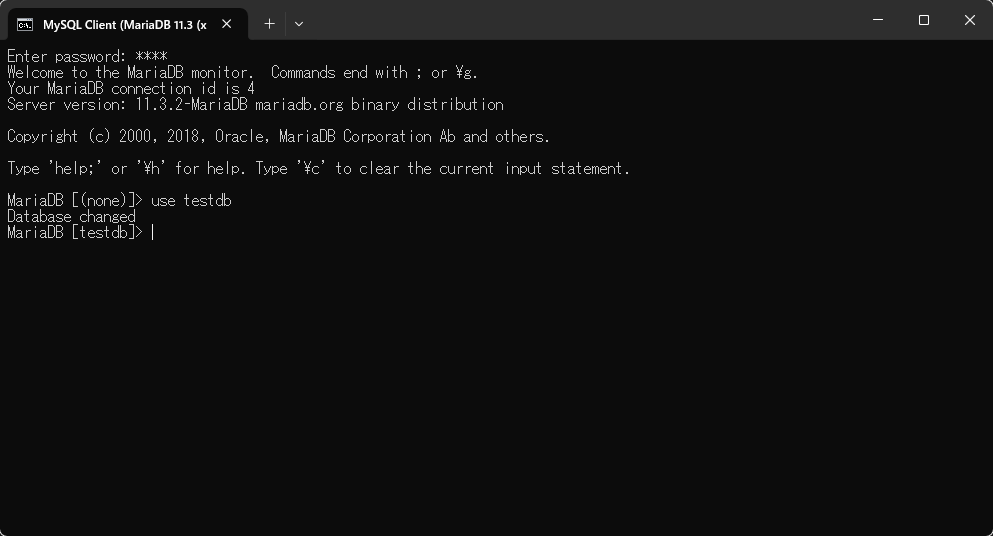
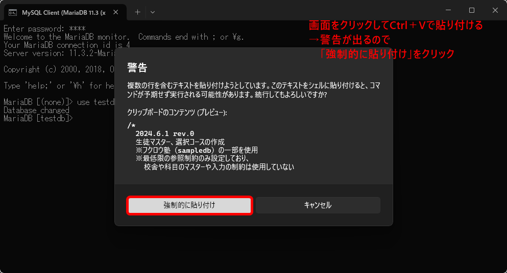
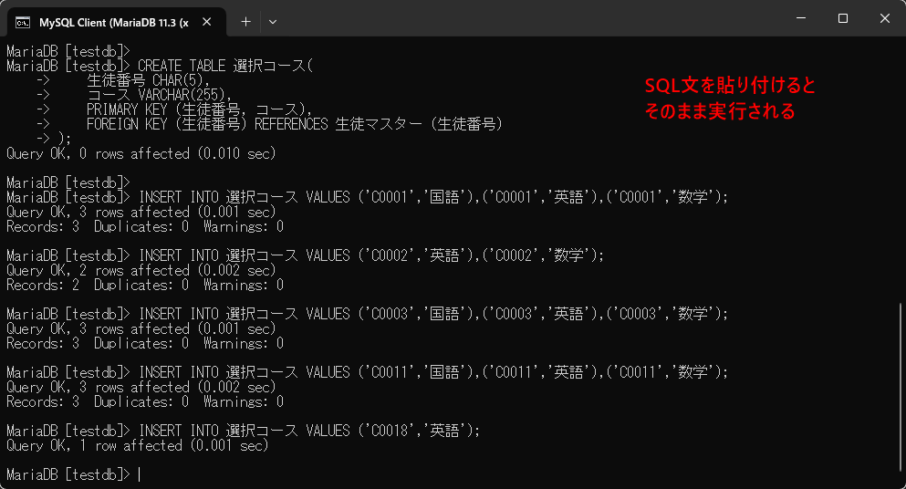

[標準SQL＋データベース入門 サポートページ](httpsnisim-m.github.iosqlbook2) 

# サンプルデータのインポート（MySQL/MariaDB、コマンドライン使用）

1. [クライアントコマンドの起動](#クライアントコマンドの起動)
2. [データーベースの作成](#データーベースの作成)
   1. [既に同名のデータベースがある場合は削除する](#既に同名のデータベースがある場合は削除する)
   2. [データベースを作成する](#データベースを作成する)
3. [サンプルデータの取り込み](#サンプルデータの取り込み)
   1. [サンプルデータをコピー＆ペーストする方法](#サンプルデータをコピーペーストする方法)

## クライアントコマンドの起動

MySQLはmysqlコマンド、MariaDBはmysqlまたはmariadbコマンドで接続し、SELECT文などを実行できます。

#### Linux環境の場合
```
mariadb -u ユーザー名 -p
mysql -u ユーザー名 -p
```
※`-p`オプションはパスワードを使って接続するオプウション。ログインしているユーザー名と同じ名前でデータベースに接続する場合は`-u`オプションは省略可能。

#### Windows環境の場合
スタートメニューに登録されているクライアントコマンドを使用（mysql.exeが実行される）。

## データーベースの作成

MySQL/MariaDBでは、❶`CREATE DATABASE`で「データベース」を作成し、❷`use データベース名`で使用するデータベースを選択し、❸`CREATE TABLE`でテーブルを作成してデータを登録します。

本書ではサンプルデータ用のデータベースとしてtestdb, sampledb, sampledb2の3つを使用しています。

### 既に同名のデータベースがある場合は削除する

```
DROP DATABASE IF EXISTS testdb;
DROP DATABASE IF EXISTS sampledb;
DROP DATABASE IF EXISTS sampledb2;
```

### データベースを作成する

```
CREATE DATABASE testdb;
CREATE DATABASE sampledb;
CREATE DATABASE sampledb2;
```

#### 補足事項

本書では、文字列の並び順としてUbuntu環境およびWindows環境の初期値で日本語も扱いやすい`utf8mb4`を使用しています。環境やバージョンによって異なる文字コードが指定されている場合、`ORDER BY`で名前等の列を指定した際に、サンプルの実行結果と異なる並び順になることがあります。

データベース作成時に使用する文字列を明示するには以下の様に指定します。

```
CREATE DATABASE testdb
  DEFAULT CHARACTER SET utf8mb4
  DEFAULT COLLATE utf8mb4_unicode_ci;

CREATE DATABASE sampledb
  DEFAULT CHARACTER SET utf8mb4
  DEFAULT COLLATE utf8mb4_unicode_ci;

CREATE DATABASE sampledb2
  DEFAULT CHARACTER SET utf8mb4
  DEFAULT COLLATE utf8mb4_unicode_ci;
```

サーバーの設定がどうなっているかは、例えば以下の方法で確認できます。

```
SHOW VARIABLES LIKE 'character_set_server';
```

## サンプルデータの取り込み

サンプルデータをあらかじめダウンロードしておいてください（👉[本書で使用するサンプルデータ](https://nisim-m.github.io/sqlbook2/#%E6%9C%AC%E6%9B%B8%E3%81%A7%E4%BD%BF%E7%94%A8%E3%81%99%E3%82%8B%E3%82%B5%E3%83%B3%E3%83%97%E3%83%AB%E3%83%87%E3%83%BC%E3%82%BF)）。

1. クライアントコマンドを使用し<br/>`mariadb -u ユーザー名 -p データベース名 < ファイル名`<br/>で取り込む方法
2. クライアントコマンド実行後、<br/>`USE データベース名`でデータベースを指定した後に<br/>`source ファイル名`<br/>で取り込む方法
3. クライアントコマンド実行後、<br/>`USE データベース名`でデータベースを指定した後に、<br/>テキストエディタなどからサンプルデータをコピー＆ペーストする方法
   
があります。
Linux環境の場合は　1. の方法（👉[サンプルデータのDLと取り込み](https://nisim-m.github.io/sqlbook2/howto/install-vmware#%E3%82%B5%E3%83%B3%E3%83%97%E3%83%AB%E3%83%87%E3%83%BC%E3%82%BF%E3%81%AEdl%E3%81%A8%E8%AA%AD%E3%81%BF%E8%BE%BC%E3%81%BF)）、Windows環境の場合は3．の方法がおすすめです。

### サンプルデータをコピー＆ペーストする方法

<div class="imgtitle">❶クライアントコマンドを実行し、`USE データベース名`を実行（コマンドは小文字で可、ここではtestdbを指定）</div>
<a href="images/img1727030224.png"></a>

<div class="imgtitle">❷テキストエディタでサンプルデータを開き全体を選択してCtrl+Cでコピー</div>
<a href="images/img1726951141.png"></a>

クライアントコマンド画面への貼り付けは以下の手順で行います。
1. クライアントコマンドの画面をクリック
2. Ctrl+Vで貼り付け
3. 複数行の警告が出るので「強制的に貼り付け」をクリック

<div class="imgtitle">❸クライアントエディタの画面に貼り付ける</div>
<a href="images/img1727030503.png"></a>
<a href="images/img1727030520.png"></a>

クライアントコマンドでは「改行で実行」（SQL文の場合は`;`が入っていたら実行）されるので、テキストの貼り付けのみで実行されます。貼り付けた際に最後の1行がプロンプト（`>`記号）の後に残っていたらEnterキーを押して実行してください。

<!--
### sourceコマンドを使用する方法

#### Linux環境の場合
#### Windows環境の場合

-->

