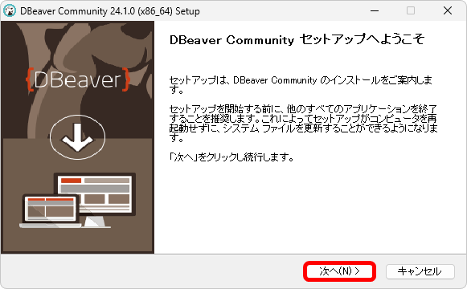

[標準SQL＋データベース入門 サポートページ](https://nisim-m.github.io/sqlbook2/) 

<!-- TOC -->
1. [DBeaverのダウンロード](#dbeaverのダウンロード)
2. [DBeaverのインストール](#dbeaverのインストール)
3. [起動と各DBMSの設定](#起動と各dbmsの設定)
   1. [MariaDBへの接続](#mariadbへの接続)
   2. [MySQLへの接続](#mysqlへの接続)
   3. [PostgreSQLへの接続](#postgresqlへの接続)
   4. [SQL Serverへの接続](#sqlserverへの接続)
<!-- TOC -->

## DBeaverのダウンロード

DBeaverのダウンロードページ [https://dbeaver.io/download/](https://dbeaver.io/download/) でインストーラーをダウンロードします。

## DBeaverのインストール

ダウンロードしたファイル（ここでは`dbeaver-ce-24.1.0-x86_64-setup.exe`）を実行します。

インストール時の言語を選択

「次へ」をクリック

「同意する」をクリック

全ユーザーで使用するか自分だけ使用するかを選択して「次へ」をクリック

「次へ」をクリック

「次へ」をクリック

「インストール」をクリック

<a href="<images/img1727567452.png>">" width="300"/></a>

「完了」をクリック

## 起動と各DBMSの設定

スタートメニューの「D」-「DBeaver Community」にある「DBeaver」で起動します。頻繁に使う場合は「スタートにピン留め」をしておくと良いでしょう。

DBeaverを起動

設定および使用方法はLinux/Windows共通です。概要は[学習用環境（Windows + VMware + Ubuntu）のページ](install-vmware#dbeaverの設定)を参照してください。

接続先の追加は「新しい接続」ボタン（Ctrl+Shift+N）で行います。

新しい接続で接続先を追加

以下は、各DBMSへの接続についてポイントのみ示します。

### MariaDBへの接続

接続タイプでMariaDBを選択

ポート番号を確認しパスワードを入力する

データベース→テーブルでテーブルの定義を確認

### MySQLへの接続

接続タイプでMariaDBを選択

ポート番号を確認しパスワードを入力する

データベース→テーブルでテーブルの定義を確認

### PostgreSQLへの接続

接続タイプでPostgreSQLを選択

ポート番号を確認しパスワードを入力する

データベース→スキーマ→public→テーブルでテーブルの定義を確認

### SQL&nbsp;Serverへの接続

DBeaverからSQL&nbsp;Serverに接続するには、SQL&nbsp;Serverの設定でTCP/IPを有効にして、ポート番号を設定する必要があります。
設定はSQL&nbsp;Server&nbsp;2022 構成マネージャーで行います。

なお、GUIベースでの接続はSQL&nbsp;Server用の管理ツールであるSSMS（👉[SQL Server Management Studio （SSMS: 管理ツール）](install-sqlserver-win#SSMS)）から行うことが可能です。

#### SQL&nbsp;Serverの設定

スタートメニューから「SQL&nbsp;Server&nbsp;2022」にある「SQL&nbsp;Server&nbsp;2022 構成マネージャー」を起動

「SQL&nbsp;Serverネットワークの構成」→「SQLEXPRESSのプトロコル」で「TCP/IP」を右クリックして有効にする

設定変更の警告メッセージが表示されたら「OK」をクリック

同じく「TCP/IP」を右クリックしてプロパティを開く

一番下にある「IPAll」のTCPポートを設定する（ここではSQL&nbsp;Serverの初期値である1433を使用）

タスクバーで右クリック→タスクマネージャ→サービスでSQL&nbsp;Serverを再起動する

指定したポート番号で接続を待機しているかどうかは、`netstat -an | findstr ポート番号`で確認できます。なにも表示されない場合、「TCP/IP」のプロパティで<strong>「IPAll」</strong>の設定を確認し、サービスでSQL&nbsp;Serverを再起動してみてください。

#### DBeaverの設定

接続タイプでSQL&nbsp;Serverを選択

ポート番号を確認し認証を「Windows Authentication」にする

データベース→Schemas→dbo→Tablesでテーブルの定義を確認

----
[標準SQL＋データベース入門 サポートページ](https://nisim-m.github.io/sqlbook2/)

