<!-- TOC -->
1. [ダウンロード](#ダウンロード)
2. [インストール](#インストール)
3. [自動起動](#自動起動)
4. [コマンドラインツール](#コマンドラインツール)
   1. [データベースの作成（初回のみ）と使用](#データベースの作成初回のみと使用)
   2. [Incorrect string value: と表示されて登録できなかった場合](#incorrect-string-value-と表示されて登録できなかった場合)
   3. [補足：SQLが実行されない場合](#補足sqlが実行されない場合)
   4. [コマンドラインツールの終了](#コマンドラインツールの終了)
   5. [2回目以降](#2回目以降)
<!-- TOC -->

## ダウンロード

https://mariadb.com/downloads/

OSでWindowsを選択してDownloadをクリック
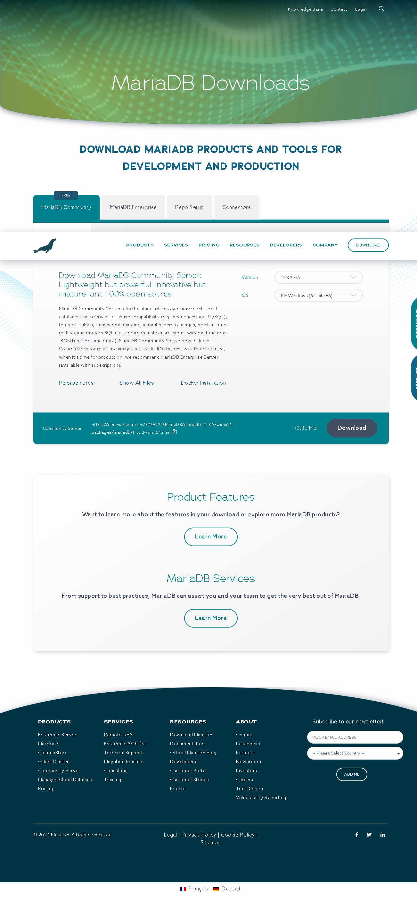

ダウンロードが自動で開始する
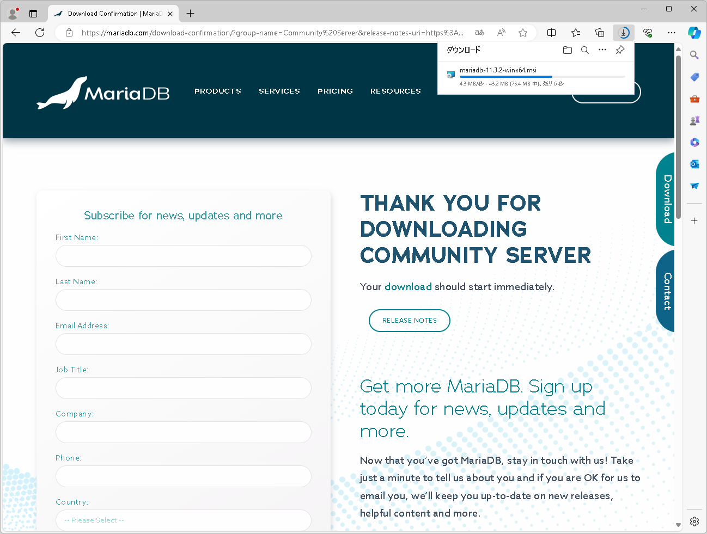

## インストール

ダウンロードしたファイル（ここでは`mariadb-11.3.2-winx64.msi`）を実行します。

Nextをクリック
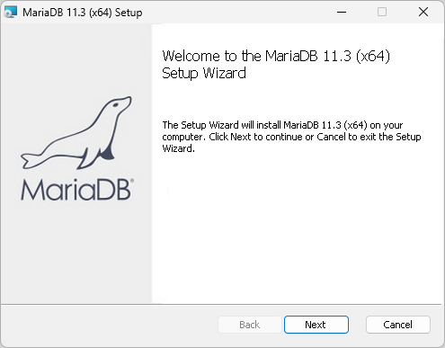

I accept the terms in the License Agreementにチェックマークを入れてNextをクリック
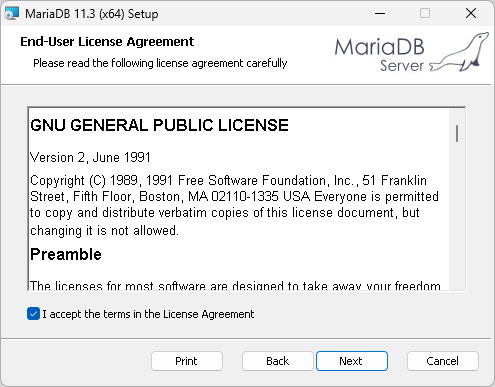

Nextをクリック
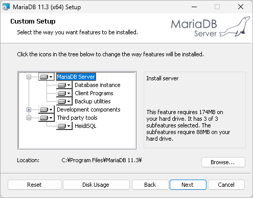

パスワードを2回入力して「Use UTF8 as default server's character set」を選択してNextをクリック
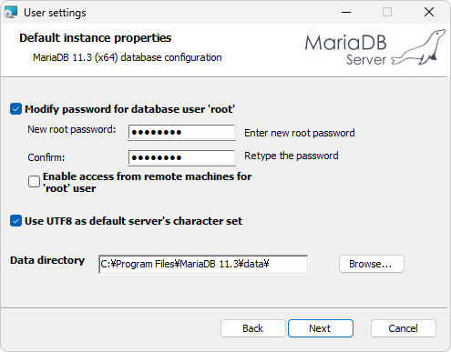

Nextをクリック※TCP port要確認、デフォルトは[3306]
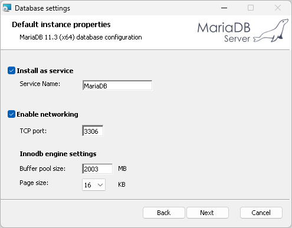

Installをクリック
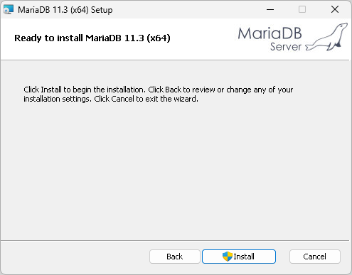

「このアプリがデバイスに変更を加えることを許可しますか」と表示されたら「はい」をクリックしてください。

（インストール中）
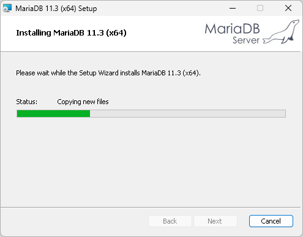

Finishをクリック
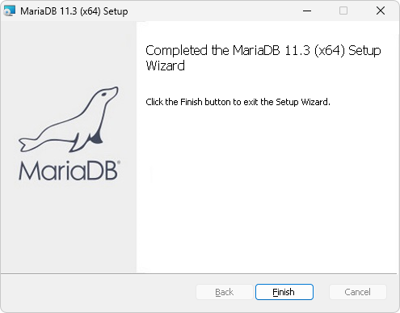


## 自動起動

起動の確認
タスクバーで右クリック→タスクマネージャー


「サービス」の「MariaDB」が「実行中」であるかどうか確認
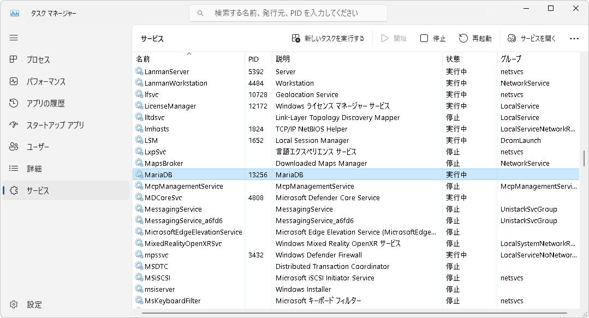

右クリックで開始/停止/再起動、「サービス管理ツールを開く」
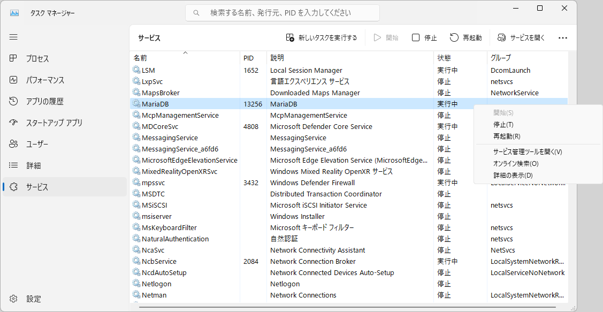

「MariaDB」を右クリック→プロパティ
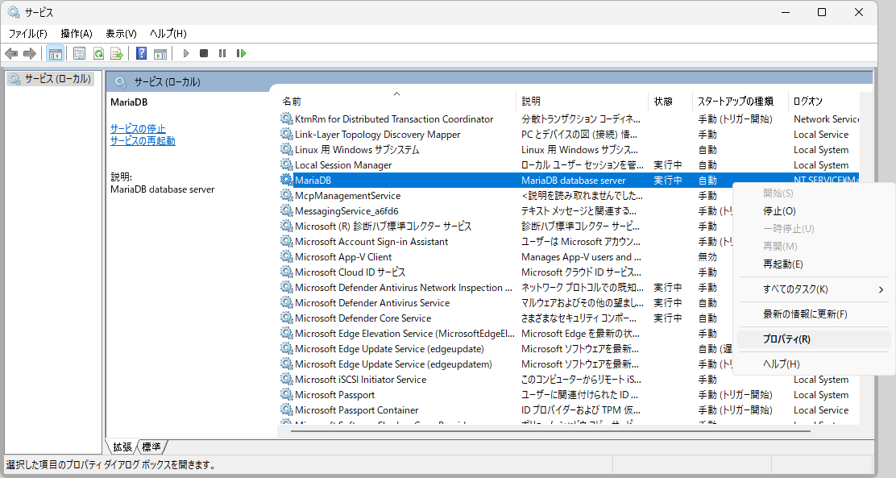

スタートアップの種類
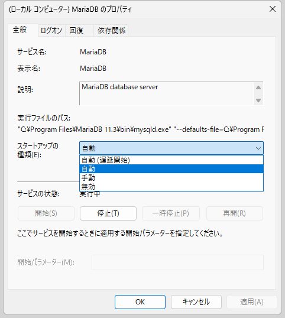


## コマンドラインツール
スタートでmariadbを探して「MySQL Client」を開く
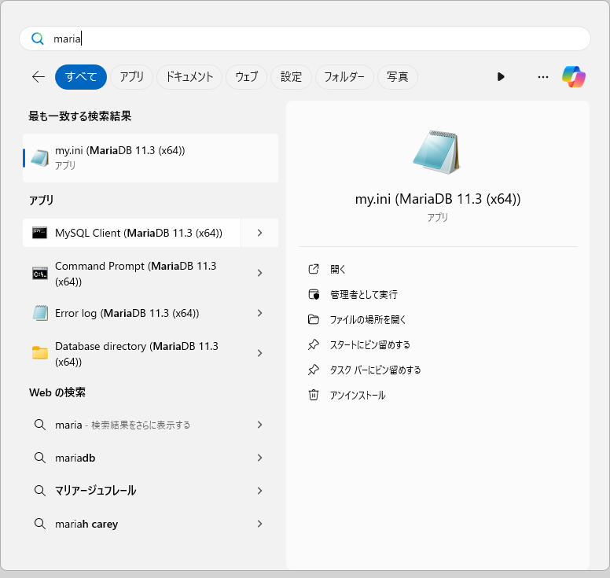

インストール時に入力したパスワードを入力して<kbd>Enter</kbd>
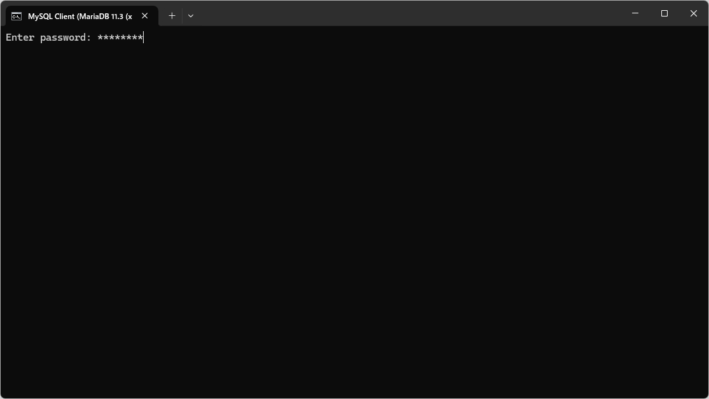

プロンプトが表示される
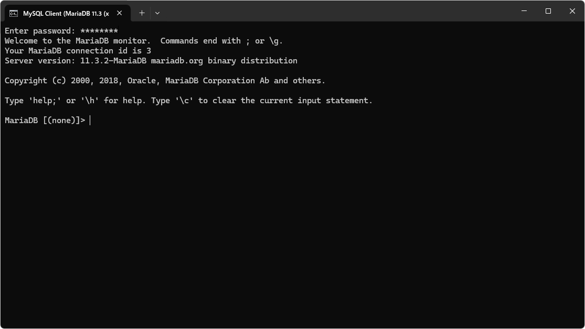

### データベースの作成（初回のみ）と使用

~~~
CREATE DATABASE testdb;
USE testdb
~~~

`USE データベース名`はMySQLやMariaDBで使用されているコマンドでSQLではありません。したがってセミコロンは不要ですが、セミコロンを付けても特に問題はありません。

2回目以降は USE testdb のみ実行してください。

データベースを作成（初回のみ）と使用
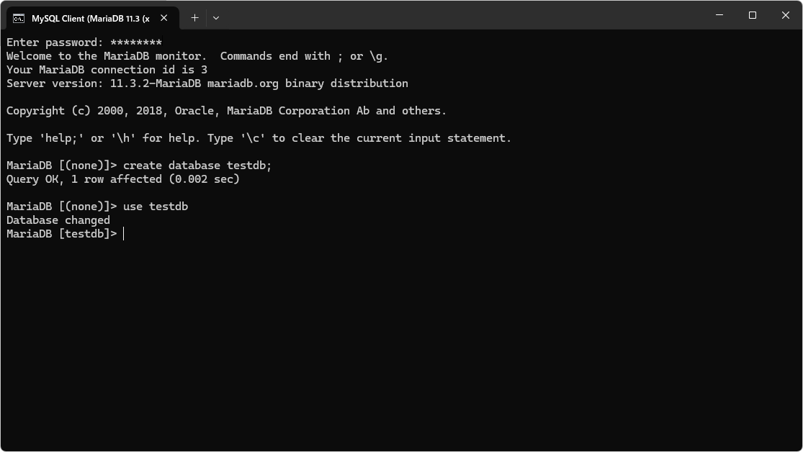

サンプルデータベース testdb.sql を選択してコピー
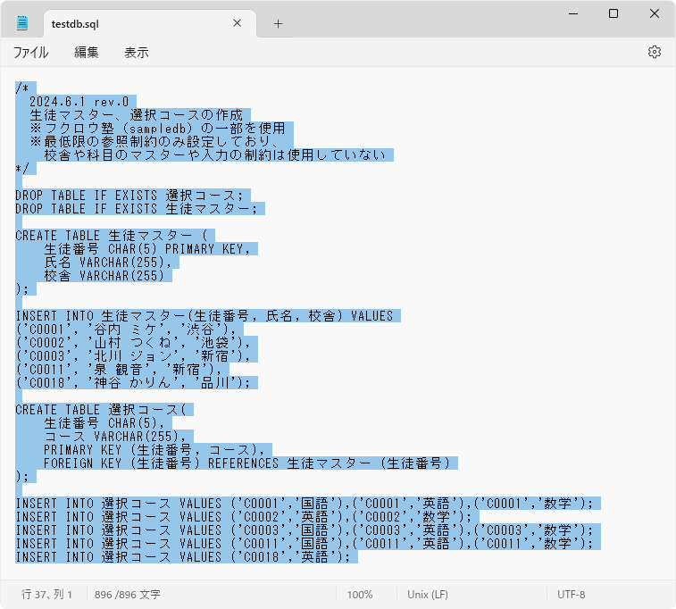

右クリックで貼り付け


（実行できた）
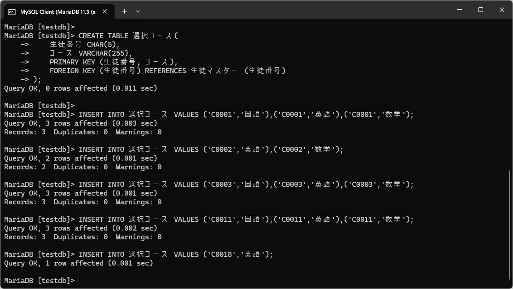


<details style="background-color: silver; padding:1em">
### <summary>Incorrect string value: と表示されて登録できなかった場合</summary>

本サイトに掲載しているサンプルコードはUTF-8を使用しています。
インストール時に「Use UTF8 as default server's character set」にチェックマークを入れていない場合、日本語の列名やデータでエラーが発生することがあります。


設定ファイル`my.ini`の`[mysqld]`ブロックに以下の行を追加してmariadbを再起動してください。

```
character-set-server=utf8mb4
```

スタートメニューでmariadbを検索してmy.iniを開く


`character-set-server=utf8mb4`という行を追加して**保存**して閉じる


タスクマネージャーの「サービス」でMariaDBを右クリック→再起動


</details>


例文を実行してみましょう。chapter1.sqlからコピーして実行することも可能です。

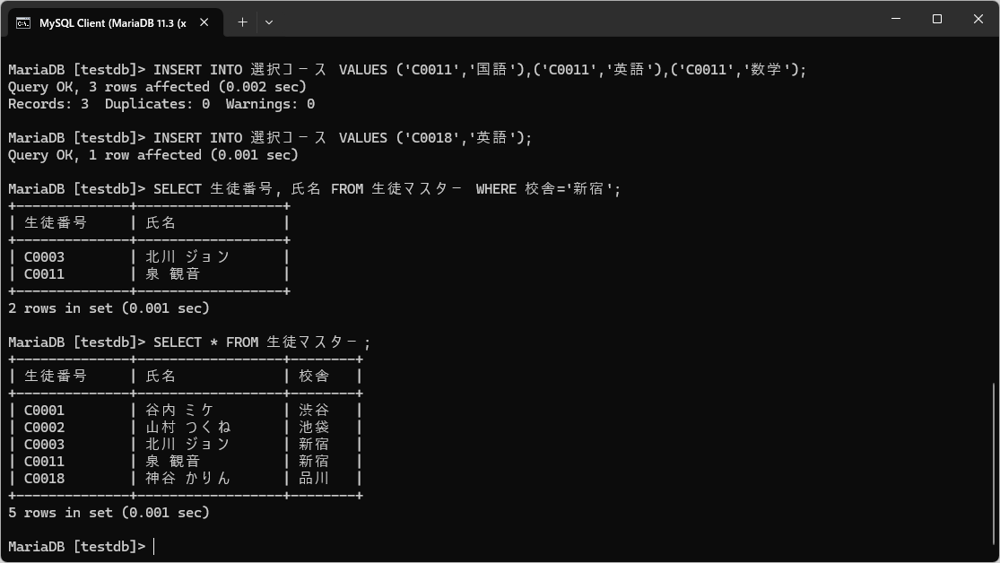

SQLが複数行になっている場合もあります。このような場合は`;`を入力した段階で実行されます。

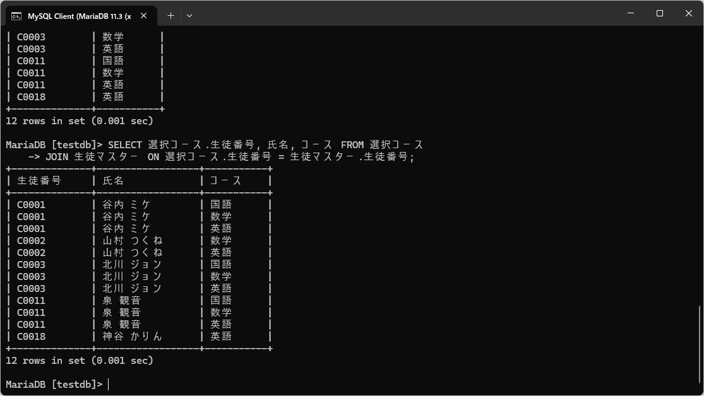

### 補足：SQLが実行されない場合

文末の`;`を入力せずに`Enter`を実行した場合、次の行の入力を待つプロンプトが表示されます。`;`だけ入力して<kbd>Enter</kbd>を押すことで実行できます。


### コマンドラインツールの終了

exitまたはquitで終了します。大文字・小文字の区別はありません。


終了したら「MySQL Client」のウィンドウを閉じてください。

`mysql --defaults-file=..\data\my.ini -uroot -p`で再開できますが、コマンドラインからではなくスタートメニューから実行する方が簡単でしょう。
`-uユーザー名`はデータベース接続時のユーザー名を指定するオプション、`-p`はパスワードを使用するというオプションです。

### 2回目以降

スタートメニューからコマンドラインツールを実行してパスワードを入力、`USE データベース名`でデータベースを使用できます。


---
