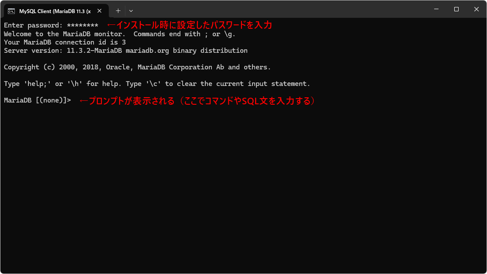

[標準SQL＋データベース入門 サポートページ](https://nisim-m.github.io/sqlbook2/) 
# 学習用環境（Windows + MariaDB）

Windows環境にはMySQL、MariaDB、PostgreSQL、SQL Serverをインストールすることができます。
ポート番号が重複しなければ共存可能で、本書掲載のSQL文は、上記4種類で動作確認を行っています。
サンプルデータによる実行結果はMariaDBL(ver11.3)によるものを掲載しています。

<!-- TOC -->
1. [MariaDBのダウンロード](#mariadbのダウンロード)
2. [MariaDBのインストール](#mariadbのインストール)
3. [自動起動の設定](#自動起動の設定)
4. [クライアントツールの起動](#クライアントツールの起動)
   1. [サンプルデータベースの作成](#サンプルデータベースの作成)
   2. [Incorrect string value: と表示されて登録できなかった場合](#incorrect-string-value-と表示されて登録できなかった場合)
   3. [補足：SQLが実行されない場合](#補足sqlが実行されない場合)
   4. [コマンドラインツールの終了](#コマンドラインツールの終了)
   5. [2回目以降](#2回目以降)
5. [テスト用ユーザーの作成](#テスト用ユーザーの作成)
   1. [【参考】スタートメニューに追加するには](#参考スタートメニューに追加するには)
6. [HeidiSQL](#heidisql)
<!-- TOC -->

## MariaDBのダウンロード

MariaDBのダウンロードページ https://mariadb.com/downloads/ より、OSでWindowsを選択してDownloadをクリックします。

## MariaDBのインストール

ダウンロードしたファイル（ここでは`mariadb-11.3.2-winx64.msi`）を実行します。
画面に従ってインストールを進めます。途中「Use UTF8 as default server's character set」にチェックマークを入れる事、および、他のDBMSをインストールしている場合はポート番号が重複しないようにしてください。

<div class="imgtitle">Nextをクリック</div><a href="images/202492405919.png">
</a>

<div class="imgtitle">I accept the terms in the License Agreementにチェックマークを入れてNextをクリック</div>
<a href="images/20249241220.png"></a>

<div class="imgtitle">パスワードを2回入力して「Use UTF8 as default server's character set」を選択してNextをクリック</div>
<a href="images/20249241258.png"></a>

<div class="imgtitle">Nextをクリック※TCP port要確認、デフォルトは[3306]</div>
<a href="images/20249241310.png"></a>

<div class="imgtitle">Installをクリック</div>
<a href="images/20249241317.png"></a>

「このアプリがデバイスに変更を加えることを許可しますか」と表示されたら「はい」をクリックしてください。

<div class="imgtitle">Finishをクリック</div>
<a href="images/20249241346.png"></a>

## 自動起動の設定

インストールが完了すると自動でMariaDBサーバーが起動します。
起動できているかどうかは「タスクマネージャー」（タスクバーで右クリック→タスクマネージャで起動）の「サービス」で確認できます。

デフォルトではMariaDBサーバーはWindows開始時に自動開始されるように設定されています。
学習時のみ手動で開始したい場合は、タスクマネージャから「サービス管理ツール」を開き、MariaDBのプロパティで「スタートアップの種類」を手動に変更します。

手動開始の際はタスクマネージャの「サービス」でMariaDBを右クリック→「開始」で開始します。

<div class="imgtitle">「サービス」の「MariaDB」が「実行中」であるかどうか確認</div>

<div class="imgtitle">タスクバーで右クリック→タスクマネージャ→サービスで実行中の確認、右クリック→サービス管理ツールを開くで設定</div>
<a href="images/202492411616.png"></a>

<div class="imgtitle">右クリック→プロパティ</div>
<a href="images/202492411759.png"></a>

<div class="imgtitle">スタートアップの種類で自動と手動を切り替える</div>
<a href="images/202492411818.png"></a>


## クライアントツールの起動

クライアントのコマンドラインツール（mysql.exe）はスタートメニューから起動できます。
<small>※MariaDBはMySQLから派生して開発されたため、コマンドラインツールの名前にmysql.exeが使われています。同じ内容のコマンドがmariadb.exeという名前でもインストールされています。</small>

<div class="imgtitle">スタートメニュー→「すべてのアプリ」の「M」にある「MySQL Client (MariaDB xx.x (x64))」で起動</div>
<a href="images/202492414040.png"></a>

<div class="imgtitle">インストール時に入力したパスワードを入力して<kbd>Enter</kbd></div>
<a href="images/202492414932.png"></a>

コマンドラインツールではMariaDB固有のコマンドとSELECT文などのSQL文を実行できます。コマンドは<kbd>Enter</kbd>で実行、SQL文の場合は`;`が入っていると実行され、入っていない場合は続きの入力をうながすプロンプト（`->`）が表示されます。続きまたは`;`を入力して<kbd>Enter</kbd>を押すとSQL文が実行されます。

### サンプルデータベースの作成

以下のリンクでサンプルデータをダウンロードしてから「[サンプルデータのインポート](https://nisim-m.github.io/sqlbook2/howto/import-mariadb)」の手順でサンプルデータを取り込んでください。
[testdb.sql](https://nisim-m.github.io/sqlbook2/sample/testdb.sql)
[sampledb.sql](https://nisim-m.github.io/sqlbook2/sample/sampledb.sql)
[sampledb2.sql](https://nisim-m.github.io/sqlbook2/sample/sampledb2.sql)

<details style="background-color: silver; padding:1em">
### <summary>Incorrect string value: と表示されて登録できなかった場合</summary>

本サイトに掲載しているサンプルコードはUTF-8を使用しています。
インストール時に「Use UTF8 as default server's character set」にチェックマークを入れていない場合、日本語の列名やデータでエラーが発生することがあります。

<a href="images/img1715012878.png"></a>

設定ファイル`my.ini`の`[mysqld]`ブロックに以下の行を追加してmariadbを再起動してください。

```
character-set-server=utf8mb4
```

<div class="imgtitle">スタートメニューでmariadbを検索してmy.iniを開く</div>
<a href="images/img1715013108.png"></a>

<div class="imgtitle">`character-set-server=utf8mb4`という行を追加して**保存**して閉じる</div>
<a href="images/img1715013604.png"></a>

<div class="imgtitle">タスクマネージャーの「サービス」でMariaDBを右クリック→再起動</div>
<a href="images/img1715013556.png"></a>

</details>


### 補足：SQLが実行されない場合

文末の`;`を入力せずに`Enter`を実行した場合、次の行の入力を待つプロンプトが表示されます。`;`だけ入力して<kbd>Enter</kbd>を押すことで実行できます。

<a href="images/img1715011577.png"></a>

### コマンドラインツールの終了

exitまたはquitで終了します。大文字・小文字の区別はありません。

<a href="images/img1715011064.png"></a>

終了したら「MySQL Client」のウィンドウを閉じてください。

`mysql --defaults-file=..\data\my.ini -uroot -p`で再開できますが、コマンドラインからではなくスタートメニューから実行する方が簡単でしょう。
`-uユーザー名`はデータベース接続時のユーザー名を指定するオプション、`-p`はパスワードを使用するというオプションです。

### 2回目以降

スタートメニューからコマンドラインツールを実行してパスワードを入力、`use データベース名`でデータベースを使用できます。

<a href="images/img1715011336.png"></a>

## テスト用ユーザーの作成

スタートメニューから実行するコマンドラインクライアントは、MariaDBの管理者である`root`ユーザーでMariaDBサーバーに接続しSQLを実行するようになっています。個人のローカルPCでテストする分にこれで問題ありませんが、テスト用のユーザーを使用したい場合は以下のコマンドで作成します。

`study`部分はデータベースに接続するユーザー、`mypqssword`部分は接続に使用するパスワードです。
適宜、ご自身のユーザー名と使用したいパスワードに置き換えて実行してください。
なお、パスワードは`ALTER USER ユーザー名 IDENTIFIED BY '新しいパスワード'`で変更できます。

```
-- データベース接続用のユーザーを作成
-- CREATE USER 'ユーザー名'@'localhost' IDENTIFIED BY 'データベース接続用のパスワード';
CREATE USER 'study'@'localhost' IDENTIFIED BY 'mypassword';
```

作成したデータベースに対し、データの追加や削除などを含めたすべての権限を与えます。
`WITH GRANT OPTION`は権限の追加や削除も行えるようにするためのオプションです。

```
GRANT ALL ON testdb.* TO 'study'@'localhost' WITH GRANT OPTION;
GRANT ALL ON sampledb.* TO 'study'@'localhost' WITH GRANT OPTION;
GRANT ALL ON sampledb2.* TO 'study'@'localhost' WITH GRANT OPTION;
```

設定した権限を再読込してmysqlコマンドを終了します。

```
FLUSH PRIVILEGES;
quit
```

mysqlコマンドが終了してWindowsのコマンドラインに戻るので、あらためてmysqlコマンドを実行します。
ユーザー「study」でパスワードを使って接続するには以下の様にします。

```
mysql -ustudy -p
```

### 【参考】スタートメニューに追加するには

スタートメニューにユーザー「study」用の起動メニューを作成したい場合は以下の様にします。

1. スタートメニューの「MySQL Client」を右クリック→その他→ファイルの場所を開くをクリック
1. 「MySQL Client」をコピーして、アイコンを右クリック→プロパティで「リンク先」の`-uroot`を`-ustudy`（-uに続けてユーザー名を入力、スペースは入れない）に変更して保存する
   

<div class="imgtitle">「ファイルの場所を開く」でフォルダを開いてショートカットのコピーを作成</div>
<a href="images/202492433620.png"></a>

<div class="imgtitle">コピーした「MySQL Client」ショートカットのプロパティで`-uroot`を`-uユーザー名`とする（この画像では`-ustudy`に変更） </div>
<a href="images/202492433749.png"></a>


## HeidiSQL

Windows版のMariaDBをインストールすると、デフォルトでHeidiSQLというGUIツールも同時にインストールされます。

ここでは、サンプルデータ登録後のデータ表示とSQL文の実行画面のみ紹介します。

<div class="imgtitle">「新規」で新しい接続を作成</div>
<a href="images/202492423931.png"></a>


<div class="imgtitle">名前を変更</div>
<a href="images/202492423939.png"></a>

<div class="imgtitle">ユーザー名とパスワード、ポート番号を入力</div>
<a href="images/202492424129.png"></a>


<div class="imgtitle"></div><a href="images/im202492424154g.png"></a>

<div class="imgtitle"></div><a href="images/202492424434.png"></a>


----
[標準SQL＋データベース入門 <small>——RDBとDB設計、基本の力</small> サポートページ](https://nisim-m.github.io/sqlbook2/)
