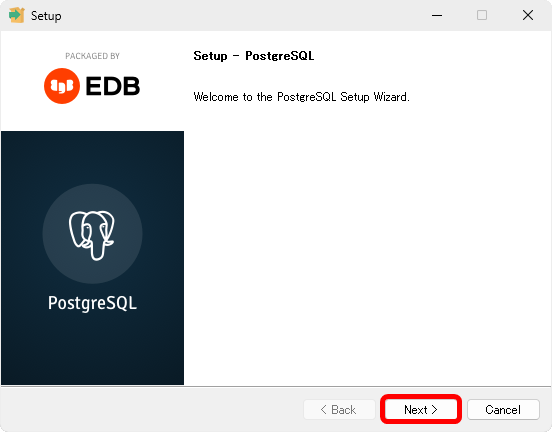
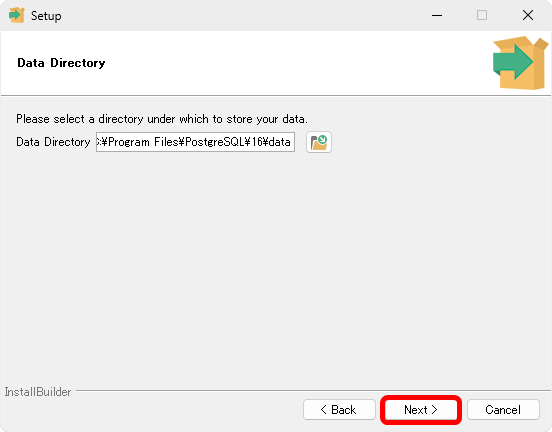

[標準SQL＋データベース入門 サポートページ](https://nisim-m.github.io/sqlbook2/) 
# 学習用環境（Windows + PostgreSQL）

<!-- TOC -->
1. [PostgreSQLのダウンロード](#postgresqlのダウンロード)
2. [PostgreSQLのインストール](#postgresqlのインストール)
3. [自動起動の設定](#自動起動の設定)
4. [クライアントツールの起動](#クライアントツールの起動)
   1. [psql用のコマンド](#psql用のコマンド)
5. [サンプルデータの取り込み](#サンプルデータの取り込み)
   1. [データベースの作成](#データベースの作成)
   2. [【参考】実行画面](#参考実行画面)
6. [テスト用ユーザーの作成](#テスト用ユーザーの作成)
<!-- TOC -->

## PostgreSQLのダウンロード

日本PostgreSQLユーザ会にダウンロードリンクの他インストールガイドなどが公開されています。Windowsのダウンロードリンクから開発サイトへ移動し、「Download the installer」からダウンロードできます。
https://www.postgresql.jp/download

<div class="imgtitle">❶ダウンロードリンクでWindowsのリンクをクリック</div>
<a href="images/img1727221676.png"></a>

<div class="imgtitle">❷Download the installerをクリック</div>
<a href="images/img1727221719.png"></a>

<div class="imgtitle">❸Windows x86-64のダウンロードアイコンをクリック（ダウンロードが自動で始まる）</div>
<a href="images/img1727221766.png"></a>
<small>※RCはリリース候補（Release Candidate、正式リリース直前のバージョン）。このスクリーンショットは9/25時点ですがこの後のインストール画面は原稿執筆時点のバージョン16.2を使用しています。16.xにおける大きな変更はありません。</small>

## PostgreSQLのインストール

ダウンロードしたファイル（ここでは`postgresql-16.2-1-windows-x64.exe`）を実行し、画面に従ってインストールを進めてください。途中のポート番号は他と重複しないように、また、DBeaverやHeidiSQL等のツールからアクセスする際の設定用の番号をメモしておいてください。

※PostgreSQLには専用のGUIツール`pgAdmin`があります。GUIツールの使用は任意、本書では使用していません。

<div class="imgtitle">Nextをクリック</div>
<a href="images/img1715016008.png"></a>

<div class="imgtitle">Nextをクリック</div>
<a href="images/img1715016062.png"></a>

<div class="imgtitle">Nextをクリック</div>
<a href="images/img1715016096.png"></a>

<div class="imgtitle">Nextをクリック</div>
<a href="images/img1715016157.png"></a>

<div class="imgtitle">パスワードを入力してNextをクリック</div>
<a href="images/img1715016265.png"></a>

<div class="imgtitle">Nextをクリック（※ポート番号 5432）</div>
<a href="images/img1715016334.png"></a>

<div class="imgtitle">Nextをクリック ※Default localeで良いか要確認</div>
<a href="images/img1715016396.png"></a>

<div class="imgtitle">Nextをクリック（設定内容が表示されている）</div>
<a href="images/img1715016441.png"></a>

<div class="imgtitle">Nextをクリック</div>
<a href="images/img1715016517.png"></a>

<div class="imgtitle">（インストール中）</div>
<a href="images/img1715016787.png"></a>

インストール開始時にStack Builderをチェックしていた場合、Stack Builderの設定が始まります。ここでは使用しないのでキャンセルをクリックしてください。

<div class="imgtitle">Stack Builderのチェックマークを外してFinishをクリック</div>
<a href="images/img1715017260.png"></a>

※Stack BuilderはODBCドライバなどを追加する際に使用します。スタートメニューで「すべてのアプリ」から「PostgreSQL」フォルダの「Application Stack Builder」から起動できます。

<a href="images/img1715017290.png"></a>

## 自動起動の設定

インストールが完了すると自動でPostgreSQLサーバーが起動します。
起動できているかどうかは「タスクマネージャー」（タスクバーで右クリック→タスクマネージャで起動）の「サービス」で確認できます。

デフォルトではPostgreSQLサーバーはWindows開始時に自動開始されるように設定されています。
学習時のみ手動で開始したい場合は、タスクマネージャから「サービス管理ツール」を開き、PostgreSQLのプロパティで「スタートアップの種類」を手動に変更します。

手動開始の際はタスクマネージャの「サービス」でPostgreSQLを右クリック→「開始」で開始します。

<div class="imgtitle">「サービス」の「PostgreSQL」が「実行中」であるかどうか確認</div>

<div class="imgtitle">タスクバーで右クリック→タスクマネージャ→サービスで「PostgreSQL」が「実行中」であるか確認、右クリック→「サービス管理ツールを開く」で設定</div>
<a href="images/2024924215828.png"></a>

<div class="imgtitle">右クリック→プロパティ</div>
<a href="images/2024924215859.png"></a>

<div class="imgtitle">スタートアップの種類で自動と手動を切り替える</div>
<a href="images/2024924215911.png"></a>

## クライアントツールの起動

クライアントのコマンドラインツール（psql.exe）はスタートメニューから起動できます。

<div class="imgtitle">スタートメニュー→「すべてのアプリ」の「P」にある「PostgreSQL」の「SQL Shell (psql)」で起動</div>
<a href="images/img1715017718.png"></a>

<div class="imgtitle">Serverなど、[]の値をそのまま使うので<kbd>Enter</kbd>で進み、インストール時に入力したパスワードを入力して<kbd>Enter</kbd></div><a href="images/202492422029.png"></a>

`postgre`はデフォルトのユーザー名（管理者）およびデータベース名（管理情報が格納）として使用されています。

コマンドラインツールでは`psql`固有のコマンドとSELECT文などのSQL文を実行できます。
コマンドは<kbd>Enter</kbd>で実行、SQL文の場合は`;`が入っていると実行され、入っていない場合は続きの入力をうながすプロンプト（データベース名の後ろの`=`が`-`に変わる）が表示されます。続きまたは`;`を入力して<kbd>Enter</kbd>を押すとSQL文が実行されます。

### psql用のコマンド

`\c データベース名`でデータベースの切り替え、`\i ファイル名`でファイルを読み込みます。
`\?`または`\h`でコマンドを確認できます。

`\`は日本語キーボードの<kbd>¥</kbd>（円マーク）で入力します。画面表示がバックスラッシュ`⧵`でも円マーク`¥`となっていても意味は同じです。

`psql`コマンドは`\q`または`quit`で終了します。


## サンプルデータの取り込み

サンプルデータをあらかじめダウンロードし、テキストエディタ（メモ帳など）で表示できるようにしておいてください。

<small>ダウンロードリンク：[testdb.sql](https://nisim-m.github.io/sqlbook2/sample/testdb.sql), [sampledb.sql](https://nisim-m.github.io/sqlbook2/sample/sampledb.sql), [sampledb2.sql](https://nisim-m.github.io/sqlbook2/sample/sampledb2.sql)（👉[サンプルデータについて](https://nisim-m.github.io/sqlbook2/#%E3%82%B5%E3%83%B3%E3%83%97%E3%83%AB%E3%83%87%E3%83%BC%E3%82%BF)）</small>

1. データベースの作成
2. `\c データベース名` でデータベースを選択
3. テキストエディタからサンプルデータをコピー＆ペースト

で取り込むことができます。

※本書用のサンプルデータはUTF-8で書かれておりWindowsのpsqlコマンドはSJISのため、`\i`コマンドによる読み込みはできません。qsqlコマンド起動時の文字コードでUTF-8は選択可能ですが、エラーや警告のメッセージが文字化けします。

### データベースの作成

以下のコマンドはまとめて選択し、`psql`の画面にペーストすることで実行できます。

データベースの削除（初回は実行不要、作り直したい場合に使用してください）
~~~SQL
DROP DATABASE IF EXISTS testdb;
DROP DATABASE IF EXISTS sampledb;
DROP DATABASE IF EXISTS sampledb2;
~~~

データベースの作成
~~~SQL
CREATE DATABASE testdb WITH ENCODING 'UTF8';
CREATE DATABASE sampledb WITH ENCODING 'UTF8';
CREATE DATABASE sampledb2 WITH ENCODING 'UTF8';
~~~

<details style="background-color: #E0E0E0; padding:1em">
#### <summary>【参考】並び順などを細かく指定したい場合</summary>

本書のサンプルを実行するにあたってはここまで設定する必要はありませんが、
PostgreSQLのCREATE DABASEで文字コードの他に並び順などを指定したい場合は、テンプレートも併せて指定する必要があります。詳しくはPostgreSQLのマニュアルを参照してください。

~~~SQL
CREATE DATABASE testdb
    WITH ENCODING 'UTF8'
    LC_COLLATE='und-x-icu'
    LC_CTYPE='und-x-icu'
    TEMPLATE template0;

CREATE DATABASE sampledb
    WITH ENCODING 'UTF8'
    LC_COLLATE='und-x-icu'
    LC_CTYPE='und-x-icu'
    TEMPLATE template0;

CREATE DATABASE sampledb2
    WITH ENCODING 'UTF8'
    LC_COLLATE='und-x-icu'
    LC_CTYPE='und-x-icu'
    TEMPLATE template0;
~~~

</details>

### 【参考】実行画面

<div class="imgtitle">クライアントツールを実行する（ここではSJIS、ユーザーpostgresを使用）</div>
<a href="images/2024924231346.png"></a>

<div class="imgtitle">サンプルデータの内容をコピー</div>
<a href="images/img1726951141.png"></a>

<div class="imgtitle">クライアントツールの画面にペースト（警告が表示されるので「強制的に貼り付け」をクリック）</div>
<a href="images/2024924231355.png"></a>

<div class="imgtitle">サンプルデータのSQL文が実行される（サンプルデータが取り込まれる）</div>
<a href="images/img1727225377.png"></a>

## テスト用ユーザーの作成

スタートメニューから実行するコマンドラインクライアントは、PostgreSQLの管理者であるpostgresユーザーでPostgreSQLサーバーに接続しSQLを実行するようになっています。個人のローカルPCでテストする分にこれで問題ありませんが、テスト用のユーザーを使用したい場合は以下のコマンドで作成します。

```
createuser -U postgres ユーザー名
createdb -U postgres -E UTF8 -O ユーザー名 データベース名
```

createuserやcreatedbコマンドは、PostgreSQLのインストールディレクトリ内のbinに格納されています。

バージョン16.xの場合は標準で`C:\Program Files\PostgreSQL\16\bin`なので、エクスプローラで`C:\Program Files\PostgreSQL\16\`を開き、`bin`を右クリック→「ターミナルで開く」でコマンドプロンプト（cmd.exe）またはPowerShellの画面が開くので、そこで実行するのが簡単でしょう。

以下はPowerShellの画面での実行例です。PowerShellの場合、カレントディレクトリにある実行ファイルを使用するには`.\`を付ける必要があります。cmd.exeの場合は不要です。

<div class="imgtitle">ターミナルで実行ファイルがインストールされている場所を開く</div>
<a href="images/img1727226392.png"></a>

<div class="imgtitle">コマンドを実行する（PowerShellの場合、`./`または`.\`を付けて実行</div>
<a href="images/2024924221548.png"></a>

----
[標準SQL＋データベース入門 <small>——RDBとDB設計、基本の力</small> サポートページ](https://nisim-m.github.io/sqlbook2/)
