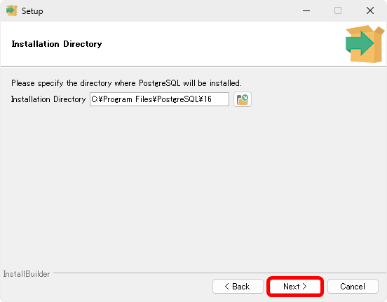
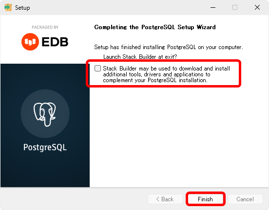

## ダウンロード

https://www.postgresql.jp/download

ダウンロードリンクでWindowsのリンクをクリック

Download the installer 

Windows x86-64のダウンロードアイコンをクリック（ダウンロードが自動で始まる）

## インストール

ダウンロードしたインストーラーを実行（ここでは`postgresql-16.2-1-windows-x64.exe`）

Nextをクリック

Nextをクリック

Nextをクリック

Nextをクリック

パスワードを入力してNextをクリック

Nextをクリック（※ポート番号 5432）

Nextをクリック ※Default localeで良いか要確認

Nextをクリック（設定内容が表示されている）

Nextをクリック

（インストール中）

Stack Builderのチェックマークを外してFinishをクリック

※Stack Builderチェックマークを入れたままの場合スタックビルダが起動するのでキャンセルで終了、スタックビルダはODBCドライバなどを追加する際に使用、スタートメニューで「すべてのアプリ」から「PostgreSQL」フォルダの「Application Stack Builder」でいつでも使用できる

起動と終了、自動実行
タスクマネージャーおよびサービスのpostgresql-x64-バージョン
⇒参考：MariaDB

## コマンドライン
スタートメニューでSQL Shellを検索して実行

