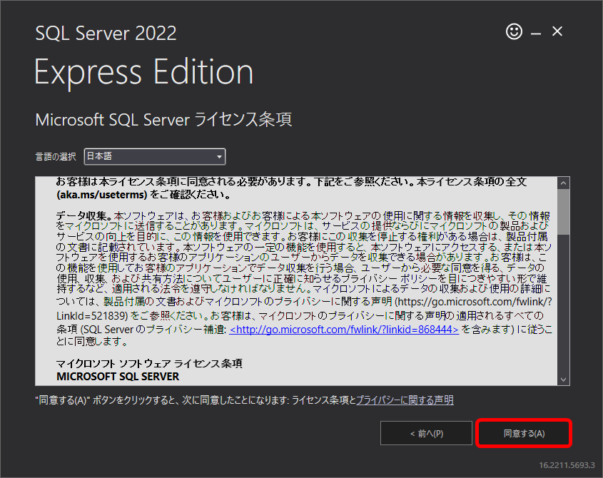

[標準SQL＋データベース入門 サポートページ](https://nisim-m.github.io/sqlbook2/) 
# 学習用環境（Windows + SQL&nbsp;Server）

<!-- TOC -->
1. [SQL Serverのダウンロード](#sqlserverのダウンロード)
2. [SQL Serverのインストール](#sqlserverのインストール)
   1. [SMSS（管理ツール）のインストール ※任意）](#smss管理ツールのインストール-任意)
3. [サンプルデータの取り込み](#サンプルデータの取り込み)
   1. [データベースの作成](#データベースの作成)
<!-- TOC -->

## SQL&nbsp;Serverのダウンロード

Microsoft SQL Serverは https://www.microsoft.com/ja-jp/sql-server/sql-server-downloads からダウンロードできます。
ここでは小規模環境であれば商用でも無償で使える「Express」を使用しています。

[SQL&nbsp;Server 2022 の各エディションとサポートされている機能 - SQL Server | Microsoft Learn](https://learn.microsoft.com/ja-jp/sql/sql-server/editions-and-components-of-sql-server-2022?view=sql-server-ver16)

## SQL&nbsp;Serverのインストール

基本をクリック

「今すぐ接続」でコマンドラインツールが起動します。

### 
SMSS（管理ツール）のインストール ※任意）

SQL Server Management Studio (SSMS)はGUIベースでSQL&nbsp;Serverに接続し、管理やデータの閲覧、SQLの実行ができるツールです。

本書では使用しませんが、SQL&nbsp;Serverを活用する上で便利でしょう。

インストール完了の画面で「SMSSのインストール」をクリックするとダウンロードサイトに接続し、インストーラーを入手できます。

[SQL Server Management Studio (SSMS) のダウンロード - SQL Server Management Studio (SSMS) | Microsoft Learn](https://learn.microsoft.com/ja-jp/sql/ssms/download-sql-server-management-studio-ssms?view=sql-server-ver16&redirectedfrom=MSDN#download-ssms)

## サンプルデータの取り込み

サンプルデータをあらかじめダウンロードし、テキストエディタ（メモ帳など）で表示できるようにしておいてください。

<small>ダウンロードリンク（SQL&nbsp;Server用）：[testdb.sql](https://nisim-m.github.io/sqlbook2/sample/testdb-sqlserver.sql), [sampledb.sql](https://nisim-m.github.io/sqlbook2/sample/sampledb-sqlserver.sql), [sampledb2.sql](https://nisim-m.github.io/sqlbook2/sample/sampledb2-sqlserver.sql)（👉[サンプルデータについて](https://nisim-m.github.io/sqlbook2/#sqlserver%E7%94%A8)）</small>

1. データベースの作成
2. `use データベース名` でデータベースを選択
3. テキストエディタからサンプルデータをコピー＆ペースト

で取り込むことができます。

<strong>SQL&nbsp;Serverのコマンドライン環境では、`GO`コマンド（小文字でも可）を実行することでコマンドが実行されます。</strong>本ページでは、他のコマンドと区別するために小文字で記載しています。

### データベースの作成

以下のコマンドはまとめて選択し、`sqlcmd`の画面にペーストすることで実行できます。

データベースの削除（初回は実行不要、作り直したい場合に使用してください）
~~~SQL
DROP DATABASE IF EXISTS testdb;
DROP DATABASE IF EXISTS sampledb;
DROP DATABASE IF EXISTS sampledb2;
go
~~~

データベースの作成
~~~SQL
CREATE DATABASE testdb COLLATE Latin1_General_100_CI_AI_SC_UTF8;
CREATE DATABASE sampledb COLLATE Latin1_General_100_CI_AI_SC_UTF8;
CREATE DATABASE sampledb2 COLLATE Latin1_General_100_CI_AI_SC_UTF8;
go
~~~

### 【参考】実行画面

クライアントツールを実行する

サンプルデータの内容をコピー

クライアントツールの画面にペースト（警告が表示されるので「強制的に貼り付け」をクリック）

サンプルデータのSQL文が実行される（サンプルデータが取り込まれる）

----
[標準SQL＋データベース入門 <small>——RDBとDB設計、基本の力</small> サポートページ](https://nisim-m.github.io/sqlbook2/)
