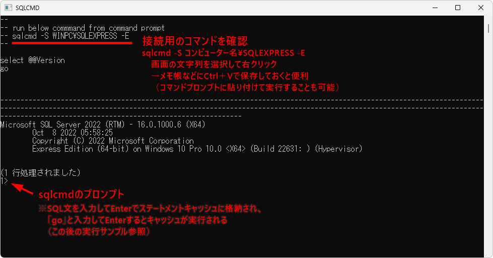

[標準SQL＋データベース入門 サポートページ](https://nisim-m.github.io/sqlbook2/) 
# 学習用環境（Windows + SQL&nbsp;Server）

<!-- TOC -->
1. [SQL Serverのダウンロード](#sqlserverのダウンロード)
2. [SQL Serverのインストール](#sqlserverのインストール)
3. [自動起動の設定](#自動起動の設定)
   1. [コマンドラインツール（sqlcmd.exe）](#コマンドラインツールsqlcmdexe)
4. [サンプルデータの取り込み](#サンプルデータの取り込み)
   1. [データベースの作成](#データベースの作成)
   2. [テキストエディタからコピー＆ペーストする際の注意事項](#テキストエディタからコピーペーストする際の注意事項)
   3. [【参考】実行画面](#参考実行画面)
   4. [【参考】sqlcmdの-iオプションでファイルから読み込む場合](#参考sqlcmdの-iオプションでファイルから読み込む場合)
5. [SQL Server Management Studio （SSMS: 管理ツール）](#sql-server-management-studio-ssms-管理ツール)
<!-- TOC -->

## SQL&nbsp;Serverのダウンロード

Microsoft SQL Serverは [https://www.microsoft.com/ja-jp/sql-server/sql-server-downloads](https://www.microsoft.com/ja-jp/sql-server/sql-server-downloads) からダウンロードできます。
ここでは小規模環境であれば商用でも無償で使える「Express」を使用しています。

<div class="imgtitle">SQL&nbsp;Server 2022 Expressをダウンロード</div><a href="images/img1727531546.png"></a>

[SQL&nbsp;Server 2022 の各エディションとサポートされている機能 - SQL Server | Microsoft Learn](https://learn.microsoft.com/ja-jp/sql/sql-server/editions-and-components-of-sql-server-2022?view=sql-server-ver16)

## SQL&nbsp;Serverのインストール

基本をクリック

<div class="imgtitle">基本をクリック</div>
<a href="images/img1727533408.png"></a>

<div class="imgtitle">「同意する」で進む</div>
<a href="images/img1727533469.png"></a>

<div class="imgtitle">「インストール」をクリック</div>
<a href="images/img1727533332.png"></a>

<div class="imgtitle">ダウンロードとインストールが進行するのでしばらく待つ</div>
<a href="images/img1727533488.png"></a>

<div class="imgtitle">インストールが完了した</div>
<a href="images/img1727533673.png"></a>

「今すぐ接続」でコマンドラインツールが起動します。
<strong>起動時用のコマンドや必要なオプションが表示されているのでメモしておいてください。</strong>画面上で文字列を選択して右クリック→テキストエディタ（メモ帳）などに貼り付け（Ctrl＋V）することで保存できます。

<div class="imgtitle">コマンドラインツール（sqlcmd）から接続</div>
<a href="images/2024928142620.png"></a>

## <a name="startup" id="startup">自動起動の設定</a>

インストールが完了すると自動でSQL&nbsp;Serverが起動します。
起動できているかどうかは「タスクマネージャー」（タスクバーで右クリック→タスクマネージャで起動）の「サービス」で確認できます。

デフォルトではSQL&nbsp;ServerはWindows開始時に自動開始されるように設定されています。
学習時のみ手動で開始したい場合は、タスクマネージャから「サービス管理ツール」を開き、SQL&nbsp;Serverのプロパティで「スタートアップの種類」を手動に変更します。

手動開始の際はタスクマネージャの「サービス」でSQL&nbsp;Serverを右クリック→「開始」で開始します。

<div class="imgtitle">「サービス」の「SQL&nbsp;Server」が「実行中」であるかどうか確認</div>

<div class="imgtitle">タスクバーで右クリック→タスクマネージャ→サービスで「SQL&nbsp;Server」が「実行中」であるか確認、右クリック→「サービス管理ツールを開く」で設定</div>
<a href="images/img1727553550.png"></a>

<div class="imgtitle">右クリック→プロパティ</div>
<a href="images/img1727553561.png"></a>

<div class="imgtitle">スタートアップの種類で自動と手動を切り替える</div>
<a href="images/img1727553571.png"></a>

### <a name="client" id="client">コマンドラインツール（sqlcmd.exe）</a>

接続用のコマンドは、上記の「今すぐ接続」で確認してください。

【参考】以下はSQL&nbsp;Server（Express Edition）用のコマンドラインです。
コマンドプロンプトまたはPowershellの画面を開いて以下実行することで起動します。

```
sqlcmd -S コンピューター名\SQLEXPRESS -E
```

`-S`は接続先のサーバーを指定するオプション、`-E`はWindows認証を使用して接続するオプションです。サーバーの管理者として接続できます。

実行するとプロンプトが`数字>`に変わり、SQLコマンドが実行できるようになります（`exit`または`quit`で終了）。

#### sqlcmdの起動オプション

| オプション | 意味 |
| ---- | ---- |
| -E | セキュリティ接続（Windows認証で接続） |
| -U ユーザー名
| -P | パスワードを使って接続する |
| -S サーバー
| -H ホスト名
| -d データベース
| -q "クエリ" | クエリを実行（実行後はプロンプトが表示される）
| -Q "クエリ" | クエリを実行して終了
| -s | 列の区切り文字 |
| -W | 余分なスペースを削除 |
| -y 幅 | 可変長型の表示幅 |
| -Y 幅 | 固定長型の表示幅 |
| -u | ユニコード出力 |
| -i ファイル名 | 入力ファイル |
| -o ファイル名 | 出力ファイル |
| -? | ヘルプの表示 |

<small>※sqlcmdの場合、文字列を`VARCHAR(255)`で定義すると格納した文字数にかかわらず常に255文字の幅で表示されます。これは`-W`オプションで回避可能です。本書のSQL&nbsp;Server用のサンプルは`-W`オプションなしでもそれなりに見やすい状態とするため、氏名などを格納する列は`VARCHAR(30)`で定義しています。</small>

#### sqlcmd用のコマンド

コマンドラインツールではsqlcmd固有のコマンドとSELECT文などのSQL文を実行できます。 コマンドは<kbd>Enter</kbd>で実行、SQL文の場合はいったんキャッシュに格納され、`GO`コマンドで実行されます。すべてのSQL文には末尾の`;`が必要です。使用例は「サンプルデータの取り込み」の後で示します。

`GO`コマンドを含め、sqlcmd固有のコマンドには大小文字の区別はありません。

| コマンド | 意味 |
| GO | キャッシュに入っているSQLコマンドを実行する |
| :list | キャッシュの内容を表示する ｜
| :r ファイル名 | ファイルを読み込んでキャッシュに追加する | 
| &#x3A;o ファイル名 | 実行結果を指定したファイルに保存する ｜
| :help | ヘルプを表示する |

## <a name="import" id="import">サンプルデータの取り込み</a>

サンプルデータをあらかじめダウンロードし、テキストエディタ（メモ帳など）で表示できるようにしておいてください。

<small>［ダウンロードリンク（SQL&nbsp;Server用）：[testdb.sql](https://nisim-m.github.io/sqlbook2/sample/testdb-sqlserver.sql), [sampledb.sql](https://nisim-m.github.io/sqlbook2/sample/sampledb-sqlserver.sql), [sampledb2.sql](https://nisim-m.github.io/sqlbook2/sample/sampledb2-sqlserver.sql)（👉[サンプルデータについて](https://nisim-m.github.io/sqlbook2/#sqlserver%E7%94%A8)）］</small>

1. データベースの作成
2. `use データベース名` でデータベースを選択
3. テキストエディタからサンプルデータをコピー＆ペースト
4. `go`で実行

で取り込むことができます。
<small>※コピー＆ペーストを使用せずにファイルから読み込みたい場合は 👉[ファイルから読み込む場合](#file)</small>

<strong>SQL&nbsp;Serverのコマンドライン環境では、`GO`コマンド（小文字でも可）を実行することでコマンドが実行されます。本ページでは、他のコマンドと区別するために小文字で記載しています。</strong>

### <a name="createdb" id="createdb">データベースの作成</a>

以下のコマンドはまとめて選択し、`sqlcmd`の画面にペーストすることで実行できます。

データベースの削除（初回は実行不要、作り直したい場合に使用してください）
~~~SQL
DROP DATABASE IF EXISTS testdb;
DROP DATABASE IF EXISTS sampledb;
DROP DATABASE IF EXISTS sampledb2;
go
~~~

データベースの作成
~~~SQL
CREATE DATABASE testdb COLLATE Latin1_General_100_CI_AI_SC_UTF8;
CREATE DATABASE sampledb COLLATE Latin1_General_100_CI_AI_SC_UTF8;
CREATE DATABASE sampledb2 COLLATE Latin1_General_100_CI_AI_SC_UTF8;
go
~~~

### テキストエディタからコピー＆ペーストする際の注意事項

インストーラーから「今すぐ接続」で開いた画面の場合、一度にペーストできる行数に制限があります。testdb用のサンプルデータ（testdb-sqlserver.sql）の場合はまとめて実行できますが、sampledbおよびsampledb2用のサンプルデータは実行できません。

コマンドプロンプトから`sqlcmd`を起動してから実行してください（👉[sqlcmdの起動](#コマンドラインツールsqlcmdexe)）。

### 【参考】実行画面

コピー＆ペースト用
```
sqlcmd -S コンピューター名\SQLEXPRESS -E
```
```
CREATE DATABASE testdb COLLATE Latin1_General_100_CI_AI_SC_UTF8;
```

<div class="imgtitle">クライアントツールを起動してデータベースを作成し、useで使用する</div>
<a href="images/2024928174857.png"></a>

<div class="imgtitle">サンプルデータの内容をコピー</div>
<a href="images/img1727546125.png"></a>

<div class="imgtitle">クライアントツールの画面にペースト（警告が表示されるので「強制的に貼り付け」をクリック）</div>
<a href="images/2024928174915.png"></a>

<div class="imgtitle">goで実行（サンプルデータが取り込まれる）</div>
<a href="images/24928174925.png"></a>

### <a name="file">【参考】sqlcmdの-iオプションでファイルから読み込む場合</a>

本書用のサンプルデータはUTF-8で作成されているため、
sqlcmdの`-i`オプションでファイルを取り込みたい場合は`-f 65001`オプション（コードページを指定するオプション 👉[Microsoft Learn](https://learn.microsoft.com/ja-jp/sql/tools/sqlcmd/sqlcmd-utility)）を指定する必要があります。

実行結果の表示は文字化けしますが内容には影響ありません。

```
sqlcmd -S コンピューター名\SQLEXPRESS -E -d データベース名 -i ファイル名 -f 65001
```

<div class="imgtitle">【参考】実行画面</div>
<a href="images/24928181640.png"></a>


## <a name="SSMS" id="SSMS">SQL Server Management Studio （SSMS: 管理ツール）</a>

SQL Server Management Studio (SSMS)はGUIベースでSQL&nbsp;Serverに接続し、管理やデータの閲覧、SQLの実行ができるツールです。

本書では使用しませんが、SQL&nbsp;Serverを活用する上で便利でしょう。

ここでは、インストールとサンプルデータ登録後のデータ表示とSQL文の実行画面のみ紹介します。

インストール完了の画面で「SMSSのインストール」をクリックするとダウンロードサイト（下記URL）に接続し、インストーラーを入手できます。

[SQL Server Management Studio (SSMS) のダウンロード](https://learn.microsoft.com/ja-jp/sql/ssms/download-sql-server-management-studio-ssms?view=sql-server-ver16)

<div class="imgtitle">スクロールしてSSMSをダウンロード</div>
<a href="images/2492819144.png"></a>

<div class="imgtitle">Installをクリックしてインストールを開始</div>
<a href="images/2024928143650.png"></a>

<div class="imgtitle">しばらく待つ</div>
<a href="images/2024928143721.png"></a>

<div class="imgtitle">Closeで終了</div>
<a href="images/img1727534884.png"></a>

スタートメニューの「S」-「Microsoft SQL Server Tools 20」にある「SQL Server Management Studio 20」で起動します。頻繁に使う場合は「スタートにピン留め」をしておくと良いでしょう。

<div class="imgtitle">SQL Server Management Studio 20で起動</div>
<a href="images/24928182358.png"></a>

<div class="imgtitle">Trust server certificateに✔を入れてConnect</div>
<a href="images/24928182429.png"></a>

<div class="imgtitle">データベースを選択→テーブルを右クリックして「Design」でテーブル定義の表示</div>
<a href="images/24928185054.png"></a>

<div class="imgtitle">テーブルを右クリック→「Select Top 1000 Rows」で先頭1000行の表示</div>
<a href="images/24928185043.png"></a>

<div class="imgtitle">データベースを右クリック→「New Query」でクエリ画面が開く（F5で実行）</div>
<a href="images/24928185125.png"></a>

----
[標準SQL＋データベース入門 <small>——RDBとDB設計、基本の力</small> サポートページ](https://nisim-m.github.io/sqlbook2/)
