[標準SQL＋データベース入門 サポートページ](https://nisim-m.github.io/sqlbook2/) 
# 学習用環境（Windows + VMware + Ubuntu）

<!-- TOC -->
1. [ファイルのダウンロード](#ファイルのダウンロード)
   1. [Broadcomのアカウントを作成](#broadcomのアカウントを作成)
   2. [VMwareのダウンロード](#vmwareのダウンロード)
   3. [UbunutuのISOイメージ](#ubunutuのisoイメージ)
2. [VMwareのインストール](#vmwareのインストール)
   1. [(参考) Windows機能互換性の設定の変更](#参考-windows機能互換性の設定の変更)
   2. [ライセンスキーの入力について](#ライセンスキーの入力について)
3. [仮想マシンの作成](#仮想マシンの作成)
4. [ゲストOS（Ubuntu）のインストール](#ゲストosubuntuのインストール)
   1. [CD/DVDイメージの設定](#cddvdイメージの設定)
   2. [ゲストOSの起動（初回）](#ゲストosの起動初回)
   3. [再起動後の設定](#再起動後の設定)
   4. [VMware Tools](#vmware-tools)
5. [スナップショットの活用](#スナップショットの活用)
6. [Ubuntuの設定](#ubuntuの設定)
   1. [スリープまでの時間](#スリープまでの時間)
   2. [フォルダ名をアルファベットにする](#フォルダ名をアルファベットにする)
7. [MariaDBのインストールと設定](#mariadbのインストールと設定)
   1. [インストール](#インストール)
   2. [起動の確認](#起動の確認)
   3. [自動起動の設定](#自動起動の設定)
   4. [DB管理者用パスワード設定](#db管理者用パスワード設定)
   5. [サンプル用データベースの作成](#サンプル用データベースの作成)
   6. [データベース接続用ユーザーの作成](#データベース接続用ユーザーの作成)
   7. [権限の付与](#権限の付与)
   8. [サンプルデータのDLと取り込み](#サンプルデータのdlと取り込み)
8. [DBeaverのインストールと設定](#dbeaverのインストールと設定)
   1. [DBeaverの起動](#dbeaverの起動)
   2. [DBeaverの設定](#dbeaverの設定)
   3. [DBeaverの画面](#dbeaverの画面)
9. [\[参考\]PostgreSQLのインストールと設定](#参考postgresqlのインストールと設定)
   1. [インストール](#インストール-1)
   2. [起動の確認](#起動の確認-1)
   3. [自動起動の設定](#自動起動の設定-1)
   4. [DB管理者用パスワードの設定](#db管理者用パスワードの設定)
   5. [テスト用ユーザーおよびサンプル用データベースの作成](#テスト用ユーザーおよびサンプル用データベースの作成)
   6. [サンプルデータのDLと取り込み](#サンプルデータのdlと取り込み-1)
   7. [サンプルデータの確認](#サンプルデータの確認)
   8. [DBeaverから接続するには](#dbeaverから接続するには)
<!-- /TOC -->

Ubuntuインストール後は「端末」を使い、コマンドを入力することでテスト環境に必要なソフトウェアのインストールをします。 コマンドは、以下の書式で示しています。

```
command
```

そのままコピーして使いやすくするため、プロンプトや実行結果（実行したコマンドが表示するメッセージなど）は入っていません。 実際に実行している様子の画像をつけているので、適宜参考にしてください。

テスト環境の構築に必要なコマンドラインのみを示しており、各コマンドの使い方などは紹介していません。【宣伝】Linuxコマンドにご関心がある方は姉妹本[「Linux＋コマンド入門」](https://nisim-m.github.io/linuxcmdbook/)をご覧下さい。


## ファイルのダウンロード

VMwareのインストールファイルとUbuntuのISOイメージを使用します。
VMwareのダウンロードにはBroadcomのアカウント（無料※2024年9月現在）が必要です。

### Broadcomのアカウントを作成

Broadcomでメールアドレスを登録してアカウントを作成します。
[Broadcom](https://support.broadcom.com/)

※参考：2024年9月現在
❶[Register]でメールアドレスと画像の文字列を入力して[Next]をクリック→❷入力したメールアドレス宛に6桁のverification codeが送信されるので入力して[Verify Continue]をクリック→❸名前等を入力し[Create Account]をクリック

<div class="imgtitle">❶Register</div>
<a href="images/img1726453838.png"></a>
<div class="imgtitle">❷Verify</div>
<a href="images/img1726453902.png"></a>
<div class="imgtitle">❸Create Account</div>
<a href="images/img1726453974.png">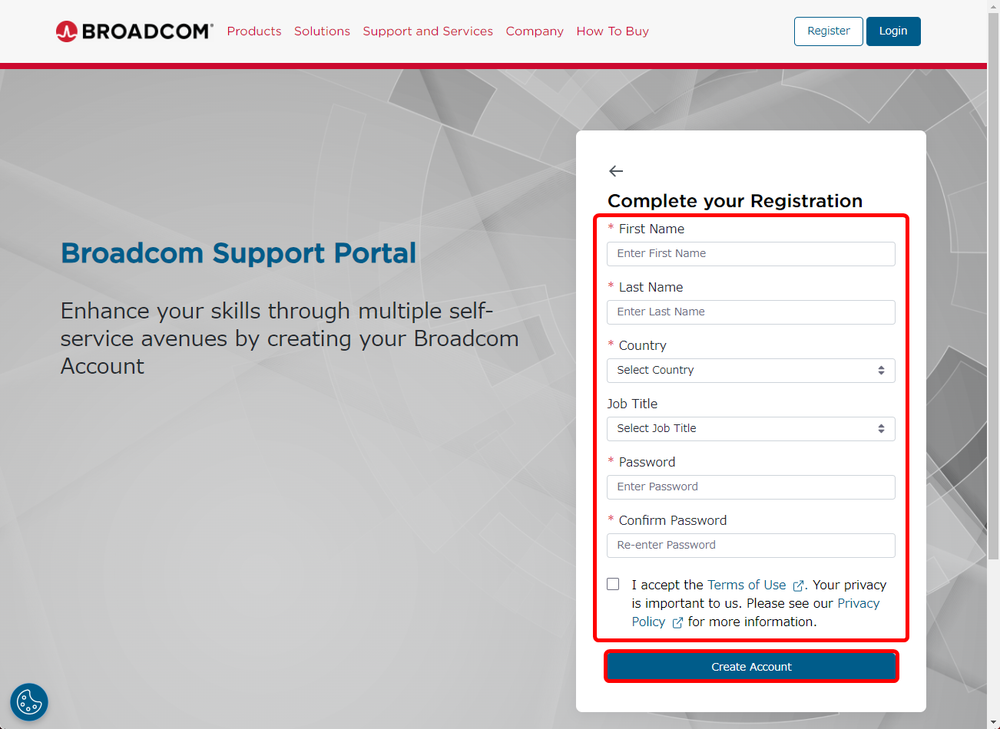</a>

### VMwareのダウンロード

ダウンロード用のリンクは以下のとおりです。❶Broadcomにログインしていない場合はログイン→❷「Personal Use」をクリックし、❸バージョンを選択して❹ダウンロードします。ダウンロードに先立ち追加のverificationが求められた場合は[Yes]で進み、❺住所を入力して[Submit]をクリックするとダウンロード画面に戻るので、❻改めてダウンロードアイコンをクリックします。

[Windows: VMware Workstation Pro Download](https://support.broadcom.com/group/ecx/productdownloads?subfamily=VMware+Workstation+Pro)
[macOS: VMware Fusion Pro Download](https://support.broadcom.com/group/ecx/productdownloads?subfamily=VMware+Fusion)

※参考：リンク元
[VMware Workstation Pro: Now Available Free for Personal Use](https://blogs.vmware.com/workstation/2024/05/vmware-workstation-pro-now-available-free-for-personal-use.html)

<div class="imgtitle">❶ログインしていない場合は先にログイン</div>
<a href="images/img1726454553.png"></a>
<div class="imgtitle">❷-1 Windows版の場合</div>
<a href="images/img1726456410.png"></a>
<div class="imgtitle">❷-2 macOS版の場合</div>
<a href="images/img1726456498.png"></a>

(以下Windows用の画面)
<div class="imgtitle">❸バージョンをクリック</div>
<a href="images/img1726456578.png"></a>
<div class="imgtitle">❹ダウンロードアイコンをクリック</div>
<a href="images/img1726456653.png"></a>

「Prior to downloading this file, additional verification is required. Proceed?」というメッセージが表示されたら[Yes]をクリック

<div class="imgtitle">Yesで先に進む</div>
<a href="images/img1726456753.png"></a>
<div class="imgtitle">❺住所を入力してSubmit</div>
<a href="images/img1726456906.png">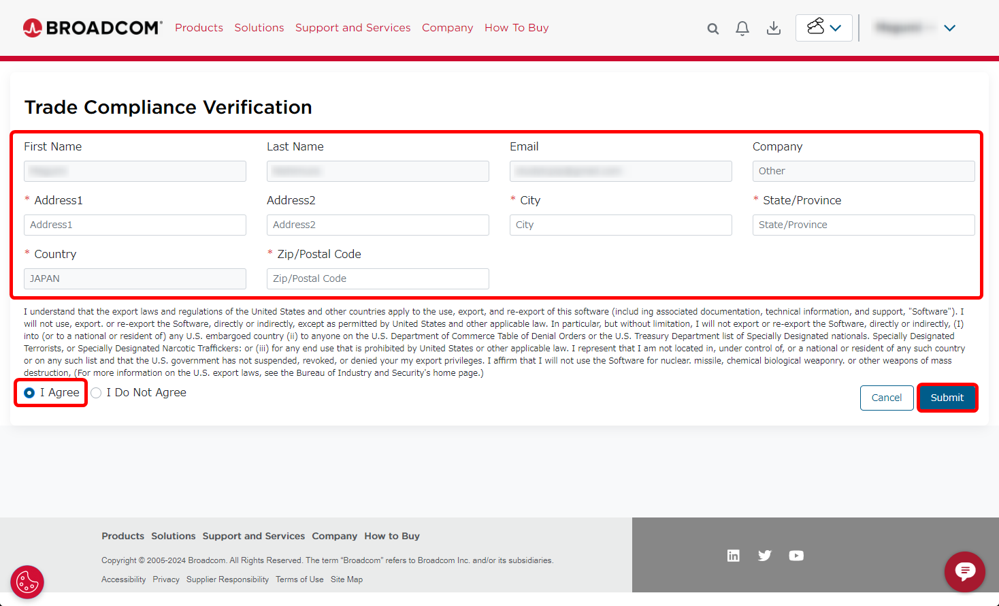</a>
<div class="imgtitle">❻ダウンロード画面に戻るのでダウンロードアイコンをクリック</div>
<a href="images/img1726457055.png"></a>

### UbunutuのISOイメージ

インストール用のイメージファイルは [https://jp.ubuntu.com/download](https://jp.ubuntu.com/download) からダウンロードできます。本書では、Ubuntu Desktop 24.04 LTS（`ubuntu-24.04-desktop-amd64.iso`）を使用しています。
※本ページでは学習用にDesktop版を選択しています。GUIツール（DBeaver等）を使用しない場合はUbuntu Serverでも問題ありません。

<div class="imgtitle">Ubuntu Desktopをダウンロード</div>
<a href="images/img1726458802.png">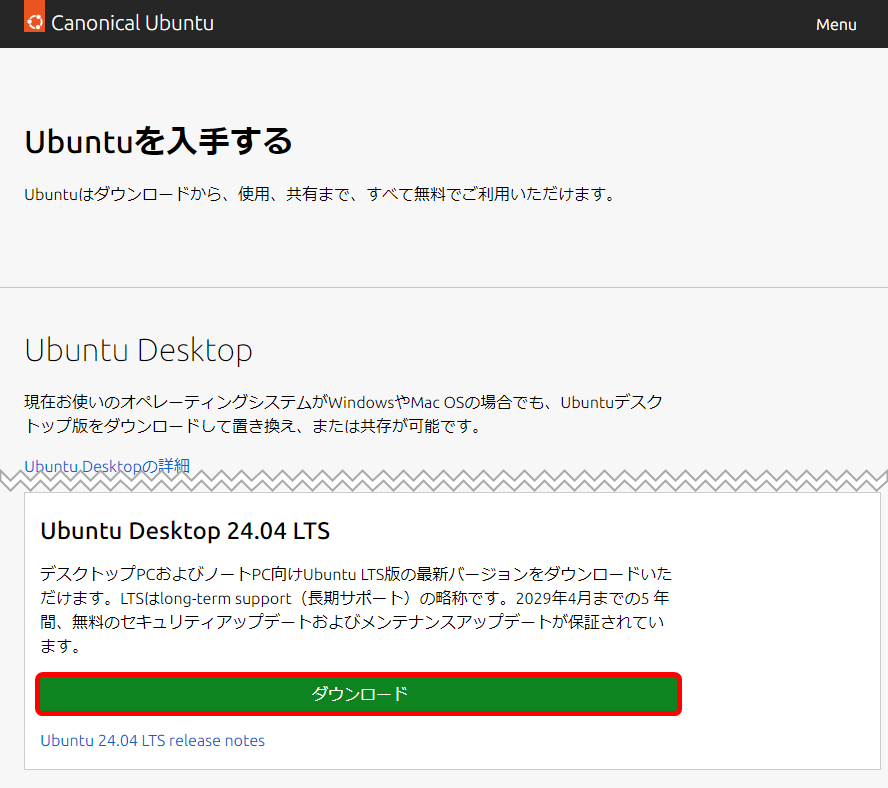</a>

上記リンクからダウンロードできない場合はミラーサイトからダウンロードしてください。httpまたはhttpsと記載があるリンクの場合はWebブラウザからのダウンロードが可能です。
[Mirrors : Ubuntu](https://launchpad.net/ubuntu/+cdmirrors)


## VMwareのインストール

インストーラを実行し、画面に従ってインストールを行います。

(参考)VMwareのインストール画面：
※Windows環境の状態やVMwareのバージョンによって異なる画面が表示される可能性があります。

<div class="imgtitle">Windowsにインストールされているソフトウェアによって下記のメッセージが表示されることがある（「はい」を選択するとすぐに再起動される：任意）</div>
<a href="images/img1718009129.png"></a>
<a href="images/img1718000956.png"></a>
<a href="images/img1718001020.png"></a>

途中の設定はいずれも任意です。

### (参考) Windows機能互換性の設定の変更

Windows機能互換性の設定の変更は他の仮想環境（WSL2やVirtualBox）に影響を与えることがあります。筆者の環境（Windows 11）ではW「indowsの機能の有効化または無効化」で「Hyper-V」「Windowsハイパーバイザープラットフォーム」「Linux用Windowsサブシステム」を有効にしてVMware, VirtualBox, WSL2が使用可能な状態になっていますが、これらの設定で動作しない、あるいはパフォーマンスが落ちる場合は、ご自身の環境にあわせて導入する仮想環境を選択してください。

[Error : Your host does not meet minimum requirements to run VMware workstation with hyper-v or device/credential guard enabled](https://knowledge.broadcom.com/external/article?legacyId=76918)

[Windows で Hyper-V を有効にする | Microsoft Learn](https://learn.microsoft.com/ja-jp/virtualization/hyper-v-on-windows/quick-start/enable-hyper-v)

<!-- <a href="images/img1718001031.png"></a> -->
<a href="images/img1726681786.png">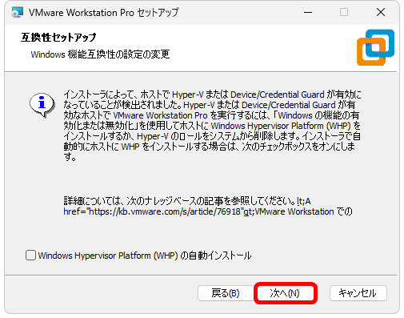</a>

[仮想マシンの拡張仮想キーボード機能の使用](https://docs.vmware.com/jp/VMware-Workstation-Player-for-Windows/17.0/com.vmware.player.win.using.doc/GUID-D7E859A1-AD77-41A0-9B20-8B15744056E1.html)

<a href="images/img1718001157.png">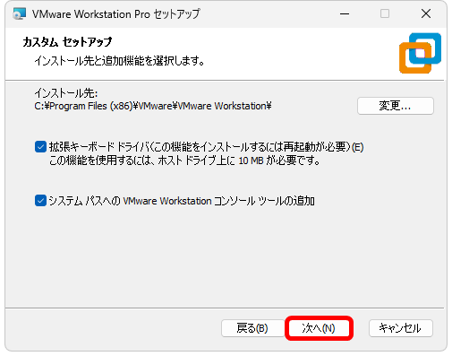</a>

<a href="images/img1718001253.png"></a>

<a href="images/img1718001275.png"></a>

<a href="images/img1718001291.png"></a>

<a href="images/img1718001373.png"></a>

<a href="images/img1718001384.png"></a>

再起動を促された場合は再起動してください。
<a href="images/img1718001403.png">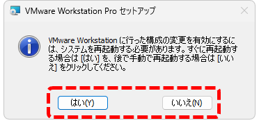</a>

### ライセンスキーの入力について

VMwareを起動するとライセンスキーの入力を求められますが、「個人利用目的」を選択することで入力をスキップできます。

<a href="images/img1718001802.png"></a>

<a href="images/img1718001844.png">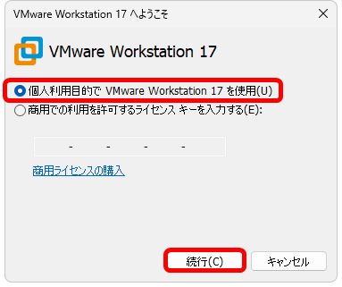</a>

<a href="images/img1718001865.png"></a>

## 仮想マシンの作成

VMwareを実行し、新規仮想マシンの作成（Ctrl+N）で仮想マシンを作成、ゲストOS（Ubuntu）をインストールします。

<a href="images/img1718001907.png"></a>

<div class="imgtitle">「標準」を選択して「次へ」</div>
<a href="images/img1718006390.png">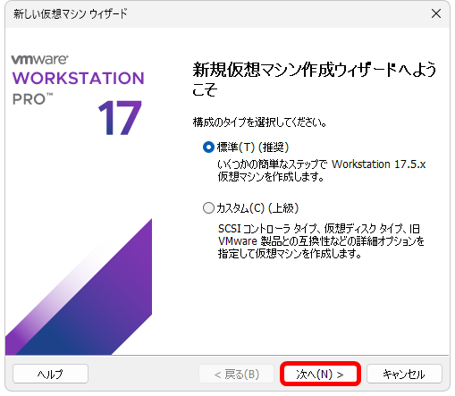</a>

<div class="imgtitle">「後でOSをインストール」を選択して「次へ」</div>
<a href="images/img1718006434.png">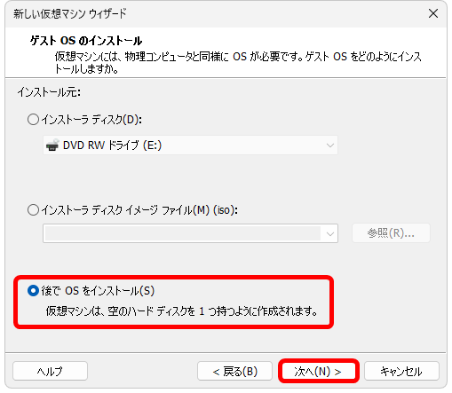</a>

<div class="imgtitle">ゲストOSを「Linux」、バージョンを「Ubuntu」にして「次へ」</div>
<a href="images/img1718006455.png"></a>

<div class="imgtitle">必要に応じ仮想マシン名とインストール先を変更して「次へ」
（ここでは自動で設定されるUbuntuのまま、インストール先はドキュメントフォルダのままにしている）</div>
<a href="images/img1718006493.png"></a>

<div class="imgtitle">必要に応じディスク容量を変更して「次へ」（今回の目的の場合20GBのままで問題ない、実際のディスクスペースは仮想マシンのインストールで使用している分のみを消費する、あとで増やすことも可能）</div>
<a href="images/img1718006590.png"></a>

<div class="imgtitle">完了で仮想マシンが作成される（設定を変更したい場合は「ハードウェアのカスタマイズ」、今回の目的の場合は不要、後から変更することも可能）</div>
<a href="images/img1718006672.png"></a>

<div class="imgtitle">（仮想マシンが作成できた）</div>
<a href="images/img1718006757.png">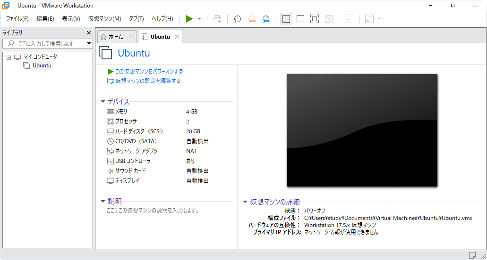</a>


ゲストOSに割り当てるメモリーのサイズは、たくさん割り当てることでゲストOSが快適に動作するようになりますが、その分、ホストOSの動作が犠牲になります。 本書のSQLを試すだけであれば、1024～2048MB程度で問題ありません。

## ゲストOS（Ubuntu）のインストール

UbuntuのISOイメージを使ってゲストOSを起動し、Ubuntuをインストールします。

### CD/DVDイメージの設定

仮想マシンの「CD/DVD」をクリック（仮想マシンを選択して「仮想マシンの設定を編集する」または「編集」→「環境設定」→「CD/DVD」）してダウンロードしてあるUbuntuのISOイメージを選択します。

<a href="images/img1718006757.png"></a>

<a href="images/img1718007169.png"></a>

### ゲストOSの起動（初回）

<div class="imgtitle">起動ボタン（▶この仮想マシンをパワーオンする）をクリックすると、仮想マシンの作成時に選択たISOイメージからUbuntuが起動するので、画面に従ってインストールを行います。</div>
<a href="images/img1718007231.png"></a>


<div class="imgtitle">「Try or Install Ubuntu」が選択されているのでEnterキーで開始</div>
<a href="images/img1726685283.png">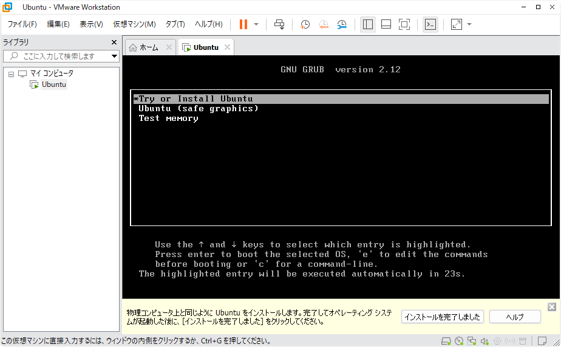</a>

<div class="imgtitle">（しばらく待つ）</div>
<a href="images/img1718007331.png"></a>

<div><small>
※インストール中に「System program problem detected」というメッセージが表示されることがある。インストールを中断・リトライした場合に多い。ひとまずCancelでインストールを続行し、その後も頻発するようだったら仮想マシンを作り直してインストールする等を検討。</small>

<a href="images/img1718041489.png">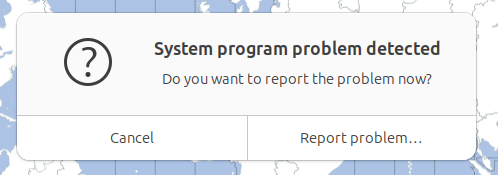</a>

<small>
※「続ける」というボタンは画面の右下に表示されています。 ※ボタンが画面上に表示されない場合はAlt+F7でスクロール（<a href="https://nisim-m.github.io/linuxcmdbook/howto/altf7.html">画面例</a>）</small></div>

ゲストOSの画面をクリックすると、キー操作やマウス入力をゲストOSが受け取る状態（キャプチャされた状態）となり、右Ctrl＋Altで解放されてホストOS側の操作が可能になります。

マウスポインタをゲストOSの外に動かすと自動的にホストOS側の操作に戻りますが、一部のキー操作（PrtScreen等）がゲストOS側にキャプチャされたままになることがあります。この場合も右Ctrl+AltでホストOS側での操作が可能になります。

<div class="imgtitle">言語の選択（下の方にスクロールすると「日本語」がある）</div>
<a href="images/img1718007392.png"></a>

<div class="imgtitle">日本語を選択するとインストール画面が日本語になり、キーボードの選択等も自動で日本語用になる（適宜変更可能）</div>
<a href="images/img1718007425.png"></a>

<a href="images/img1718007474.png">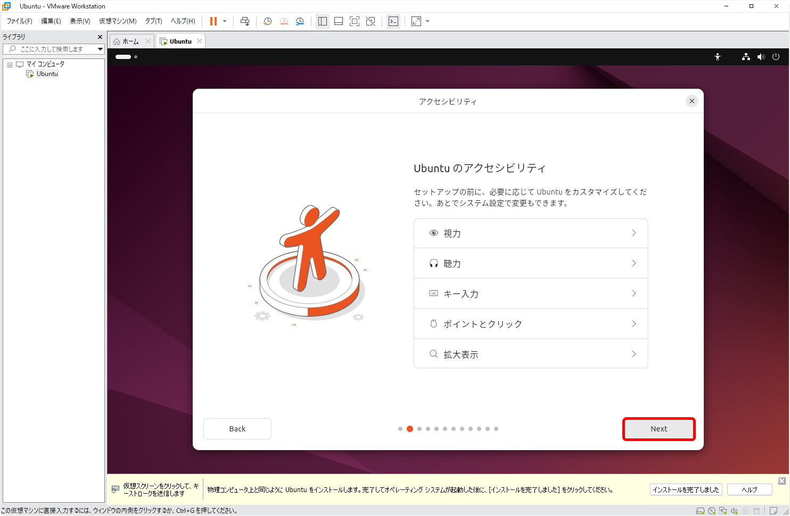</a>

<a href="images/img1718007484.png"></a>

<a href="images/img1718041310.png"></a>

<a href="images/img1718041321.png"></a>

<a href="images/img1718041333.png"></a>

<a href="images/img1718041343.png"></a>

<a href="images/img1718041362.png">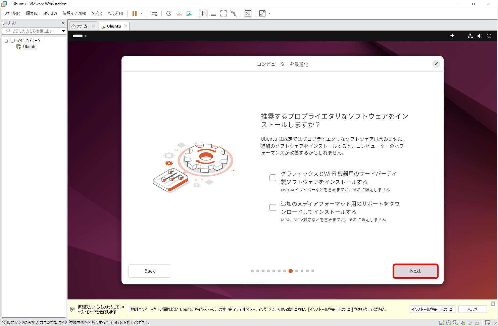</a>

<a href="images/img1718041373.png"></a>

<a href="images/img1718041389.png">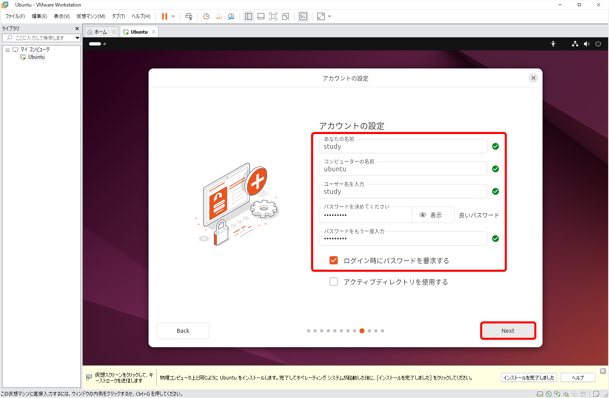</a>

<a href="images/img1718041405.png"></a>

<a href="images/img1718041615.png"></a>

<div class="imgtitle">（しばらく待つ）</div>
<a href="images/img1718041640.png"></a>

<div class="imgtitle">（再起動）</div>
<a href="images/img1718041655.png">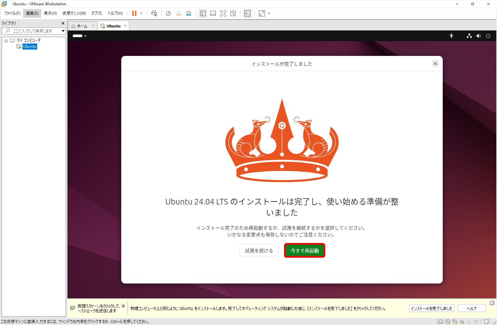</a>

<div class="imgtitle">このメッセージが出た場合Enterをクリック（再度ISOイメージからの起動（インストール画面）が開いてしまう場合は「仮想マシン」→「取り外し可能デバイス」で「CD/DVD」→「切断」を選択）</div>
<a href="images/img1718041703.png">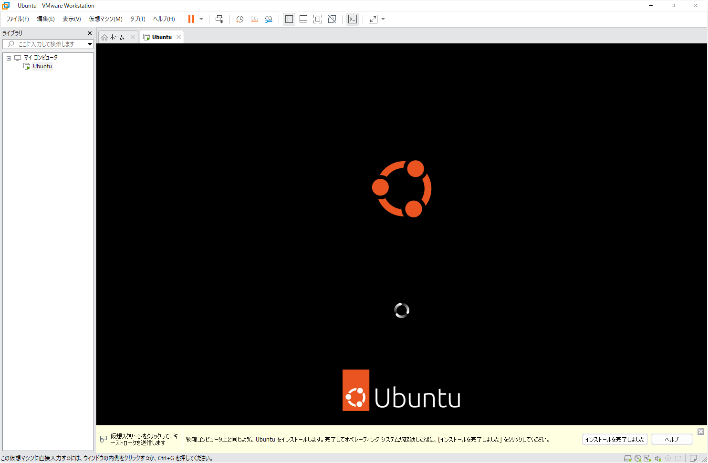</a>


### 再起動後の設定

再起動するとインストール時に設定したアカウントが表示されるので、クリックしてログインしてください。

<a href="images/img1718041790.png">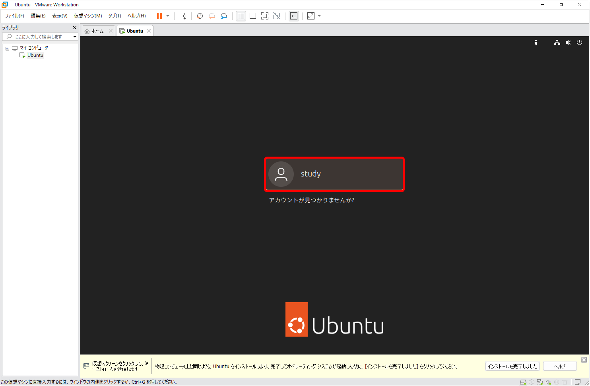</a>


<div class="imgtitle">GUI画面が表示されるのでインストールを完了させる</div>
<a href="images/img1718041810.png"></a>

<a href="images/img1718041822.png"></a>

<div class="imgtitle">（いずれも選択は任意）</div>
<a href="images/img1718041840.png"></a>

<a href="images/img1718041864.png"></a>


#### Ubuntuデスクトップ

Ubuntuデスクトップは以下の様な画面構成になっています。

<a href="images/img1727113469.png">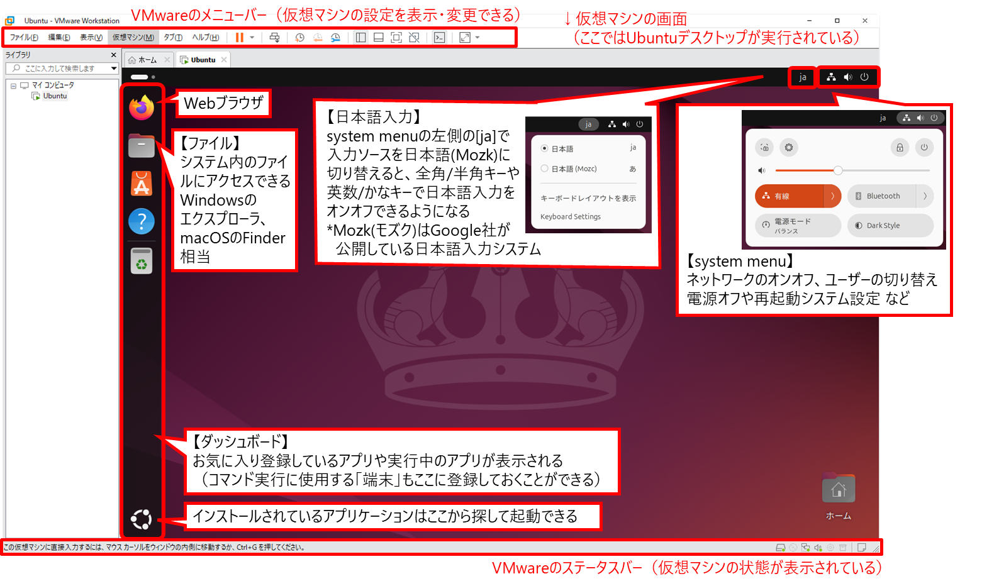</a>

#### 端末アプリ

コマンドは「端末」アプリケーションで入力して実行します。アプリはダッシュボードに登録できます。

<a href="images/img1718041891.png"></a>

<a href="images/img1718042710.png"></a>

<a href="images/img1718042723.png"></a>


### VMware Tools

「VMware Tools」をインストールすると、ホストOSと端末の間でのコピー&ペーストが可能になります。

VMware Toolsは自動インストールされますが、インストール中インターネットに接続できなかった等でインストールできていない場合があります。ホストOSと端末の間でのコピー&ペーストやファイル共有ができない場合は、「端末」で以下のコマンドを実行してVMware Toolsをインストールしてください。インストール後、再起動するとホストOSと端末の間でのコピー&ペーストが可能になります。

```
sudo apt install open-vm-tools-desktop
```
※インストール済みの場合はその旨表示される

<a href="images/img1726683006.png"></a>

## スナップショットの活用

VirtualBoxでは、任意のタイミングでゲストOSのスナップショットを作成しておくことができます。本書の学習ではあまり必要ありませんが、興味がある方は以下を参考にしてください。

<a href="https://nisim-m.github.io/linuxcmdbook/howto/install-ubuntu.html#%E3%82%B9%E3%83%8A%E3%83%83%E3%83%97%E3%82%B7%E3%83%A7%E3%83%83%E3%83%88%E3%81%AE%E6%B4%BB%E7%94%A8">スナップショットの活用（Linux1＋コマンド入門サポートページ内）</a>

## Ubuntuの設定

システム全体の設定は、デスクトップ右上をクリック→歯車のアイコン（）で開く「設定」画面で行います。

なお、デスクトップの設定は「Ubuntuソフトウェア」の「Extension Manager」でもカスタマイズできます（例：Hide ClockエクステンションでTopパネルのカレンダーを非表示にする、等）。

#### 解像度の変更

「設定」をクリック→スクロールして「ディスプレイ」を探し、クリックして「解像度」を変更、「適用」で保存
<small>※解像度はVMwareの「表示」メニューや、ウィンドウサイズの変更でも調整可能</small>

### スリープまでの時間

学習の性質上、画面を見ているが操作はしない、という時間が長くなりがちです。デフォルトでは操作していないと5分で画面がオフになりますが、この時間は「電源管理」の「省電力オプション」で設定できます。

スリープ状態のゲストOSを選択すると、入力がキャプチャされた状態（キーボードからの入力をホストOSではなくゲストOSが取得する状態）のままになることがあします。この場合は、マウスカーソルをゲストOSの外に移動するか、右Ctrl+Altで解除してください。

### フォルダ名をアルファベットにする

ユーザーフォルダ（ユーザーのホームディレクトリ）にある「書類」や「ピクチャ」などのフォルダは、WindowsやmacOSの場合、実体はDocumentsやPicturesなどのアルファベットで付けられた名前になっていますが、日本語用にインストールしたUbuntuデスクトップの場合は実体も「書類」など日本語の名前になっています。本書ではコマンドラインでこれらのフォルダを扱うことはありませんが、今後、コマンドラインでほかの操作にも慣れていこうという場合、アルファベットの名前の方が扱いやすいでしょう。変更する場合は以下のコマンドを実行し画面の指示に従ってください。

<code>
LANG=C xdg-user-dirs-gtk-update
</code>

<small>※`LANG=C`スペース`xdg-u`<kbd>Tab</kbd>`s-g`<kbd>Tab</kbd><kbd>Enter</kbd>で実行できます。パスワード入力を求められたらUbuntuインストール時のパスワードを入力してください。</small>

<div class="imgtitle">"Update standard folders～というメッセージが表示されるので「Update Names」をクリック</div>
<a href="images/img1726683626.png">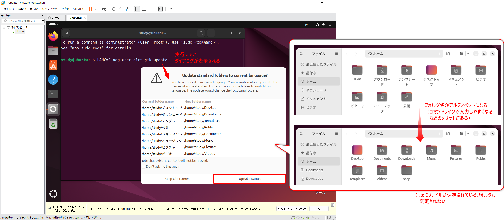</a>

再起動後あらためてフォルダ名の変更を確認するメッセージが表示されたら「次回から表示しない」にチェックマークを入れて「古い名前のままにする」をクリックしてください。

<a href="images/img1726683659.png">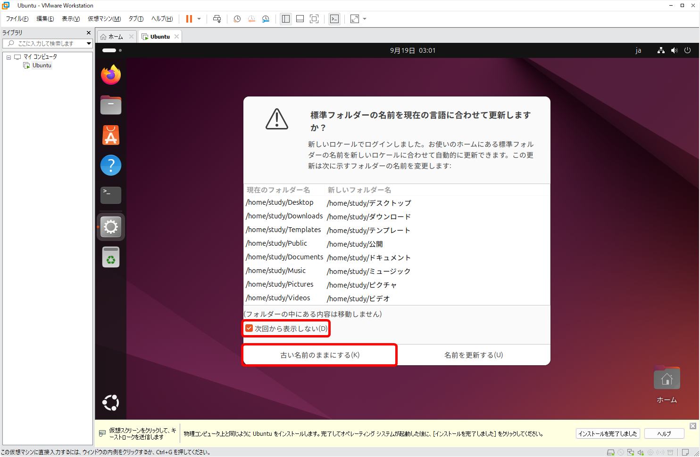</a>


## MariaDBのインストールと設定

### インストール

以下のコマンドでMariaDBをインストールします。
```
sudo apt -y install mariadb-server
```

### 起動の確認

インストールするとMariaDB（サーバー）が自動で起動します。
起動できているかどうかは下記のコマンドで確認できます（［q］キーで終了）。

```
systemctl status mariadb
```

<div class="imgtitle">（参考）実行例</div>
<a href="images/img1727131684.png">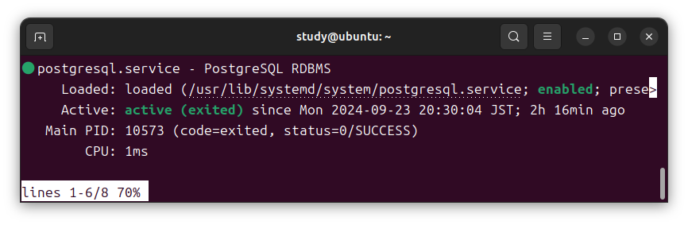</a>

<small>※`active`と表示されていない場合は、`sudo systemctl restart mariadb`を実行してエラーメッセージの有無を確認、エラーメッセージが出ていたら公式サイト等で確認。</small>

### 自動起動の設定

MariaDBはデフォルトで自動起動されるよう設定されています。
通常、変更する必要はありません。変更したい場合や現在の設定を確認したい場合は以下のコマンドを使用してください。

```
# 無効にする
sudo systemctl disable mariadb
# 有効にする場合：
sudo systemctl enable mariadb
# 現在の設定を確認する
systemctl is-enabled mariadb
```

### DB管理者用パスワード設定
mariadb-secure-installationコマンドで、最低限のセキュリティ設定およびデータベース管理者（root）でMySQLサーバーに接続する際のパスワードを設定します。 root用のパスワードを入力する他は、基本的に、すべて「y」で処理を進めてください。

```
sudo mariadb-secure-installation
```
<small>MariaDBはMySQLを元に開発されたデータベースで、多くのコマンド名が共通で使える様になっています。`mariadb-secure-installation`と`mysql_secure_installation`の機能は同じです。</small>


<div class="codetitle">（参考）実行画面サンプル（👉<a href="./mariadb-createdb-console">実行ログ全体</a>）</div>
~~~console
$ sudo mariadb-secure-installation 

NOTE: RUNNING ALL PARTS OF THIS SCRIPT IS RECOMMENDED FOR ALL MariaDB
      SERVERS IN PRODUCTION USE!  PLEASE READ EACH STEP CAREFULLY!

In order to log into MariaDB to secure it, we'll need the current
password for the root user. If you've just installed MariaDB, and
haven't set the root password yet, you should just press enter here.

Enter current password for root (enter for none): 
OK, successfully used password, moving on...

（略）

All done!  If you've completed all of the above steps, your MariaDB
installation should now be secure.

Thanks for using MariaDB!
$
~~~

### サンプル用データベースの作成

mariadbコマンド（MariaDBサーバーに接続するためのコマンドでmysqlという名前でも実行可能）で、サンプル用のデータベースと、データベースに接続するためのユーザーを作成します。

```
sudo mariadb -u root -p
```
<small>`-u root`はユーザー名rootで接続、`-p`はパスワードを使用するという意味のオプション</small>

mariadbが起動すると、MariaDB[(none)]>というプロンプトが表示されるので、以下のコマンドを実行します。  
`--`以降はコメントなので入力不要です。この画面からコピー＆ペーストして実行する場合は`--`以降の部分も一緒にペーストしても問題ありません。
 また、SQLのキーワードは大文字にしていますが、入力は小文字でもかまいません（👉2.1節「標準SQLと基本的な書式」）。

```
-- サンプルデータベース用のデータベース3つを作成
CREATE DATABASE testdb default character set utf8mb4;
CREATE DATABASE sampledb default character set utf8mb4;
CREATE DATABASE sampledb2 default character set utf8mb4;

-- 確認（MariaDBで管理しているデータベースが一覧表示される）
SHOW DATABASES;
```

引き続き、データベース接続用のユーザーを作成します。

### データベース接続用ユーザーの作成

データベース接続用ユーザーユーザーを作成します。ここでは、Ubuntuをインストールする際に作成したユーザー名と同じ名前のユーザー（study）を作成しています。  

`study`部分はデータベースに接続するユーザー、`mypqssword`部分は接続に使用するパスワードです。 適宜、ご自身のユーザー名と使用したいパスワードに置き換えて実行してください。  
なお、パスワードは`ALTER USER ユーザー名 IDENTIFIED BY '新しいパスワード'`で変更できます。

```
-- データベース接続用のユーザーを作成
-- CREATE USER 'ユーザー名'@'localhost' IDENTIFIED BY 'データベース接続用のパスワード';
CREATE USER 'study'@'localhost' IDENTIFIED BY 'mypassword';
```

### 権限の付与

作成したデータベースに対し、データの追加や削除などを含めたすべての権限を与えます。 
`WITH GRANT OPTION`は権限の追加や削除も行えるようにするためのオプションです。

ここでは上で作成したユーザー「study」を使用しています。`study`部分は適宜ご自身が作成したユーザー名に置き換えて実行してください。

```
GRANT ALL ON testdb.* TO 'study'@'localhost' WITH GRANT OPTION;
GRANT ALL ON sampledb.* TO 'study'@'localhost' WITH GRANT OPTION;
GRANT ALL ON sampledb2.* TO 'study'@'localhost' WITH GRANT OPTION;
```

設定した権限を再読込してmariadbコマンドを終了します。

```
FLUSH PRIVILEGES;
quit
```

<a href="./mariadb-createdb-console">（参考）実行画面サンプル</a>

### サンプルデータのDLと取り込み

サンプルデータをダウンロードします。
ファイルはカレントディレクトリに保存されます。

👉[サンプルデータについて](https://nisim-m.github.io/sqlbook2/#%E3%82%B5%E3%83%B3%E3%83%97%E3%83%AB%E3%83%87%E3%83%BC%E3%82%BF)

```
wget https://nisim-m.github.io/sqlbook2/sample/testdb.sql
wget https://nisim-m.github.io/sqlbook2/sample/sampledb.sql
wget https://nisim-m.github.io/sqlbook2/sample/sampledb2.sql
```

mariadbコマンド（MariaDBサーバーに接続するためのコマンドでmysqlという名前でも実行可能）で
「mariadb -u ユーザー名 -p データベース名 < SQLファイル」のように実行することで、サンプルデータを登録できます。`-u`はデータベースに接続するユーザーを指定するオプションで、現在ログイン中のユーザーと同じ名前である場合は省略できます。`-p`はパスワードを使って接続するというオプションです。

```
mariadb -p testdb < testdb.sql
mariadb -p sampledb < sampledb.sql
mariadb -p sampledb2 < sampledb2.sql
```

※管理者（root）で取り込む場合
```
mariadb -u root -p testdb < testdb.sql
mariadb -u root -p sampledb < sampledb.sql
mariadb -u root -p sampledb2 < sampledb2.sql
```

## DBeaverのインストールと設定

Ubuntu環境の場合、DBeaverは`snap`コマンドでインストールできます。

```
sudo snap install dbeaver-ce
```

ダウンロードとインストールが終わると`installed`と表示されます。

<div class="codetitle">（参考）実行画面サンプル</div>
~~~console
study@ubuntu:~$ sudo snap install dbeaver-ce
[sudo] study のパスワード: 
dbeaver-ce 24.2.0.202409011551 from DBeaver (dbeaver-corp) installed
study@ubuntu:~$ 
~~~

### DBeaverの起動

DBeaverはダッシュボードに登録して起動できます。
<a href="images/img1726942093.png"></a>
<a href="images/img1726943392.png">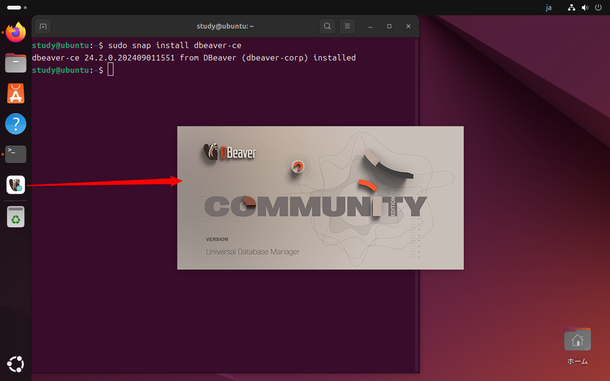</a>

### DBeaverの設定

初回起動時、サンプルデータベースを作成するかどうかのメッセージが表示されます。サンプルは不要なので「いいえ」をクリックして進みます。

<div class="imgtitle">「Create sample database」は「いいえ」で進む</div>
<a href="images/img1726942236.png"></a>

「新しい接続を作成する」というダイアログが表示されるので、画面に従って設定を行います。

<small>※接続するDBMSを追加する場合はShift+Ctrl+N（データベース→新しい接続）で再度この画面を開くことができます。</small>

<div class="imgtitle">「新しい接続を作成する」でMariaDBを選択して「次へ」をクリック</div>
<a href="images/img1726943494.png"></a>

<div class="imgtitle">認証の情報（ユーザー名とパスワード）を入力して「終了」</div>
<a href="images/img1726943521.png">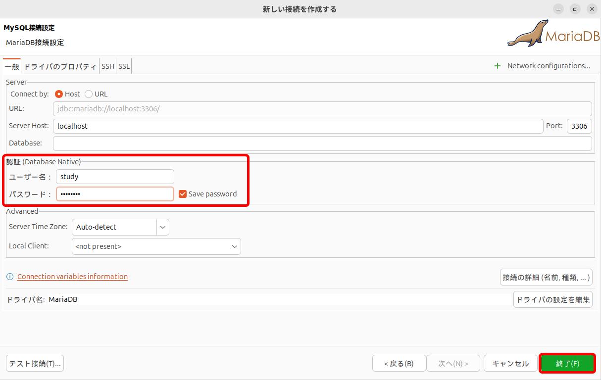</a>

<div class="imgtitle">製品パフォーマンス改善用のデータ送信を行うかどうか：適宜選択して「Confirm」</div>
<a href="images/img1726943540.png"></a>

「localhost」をクリックすると「ドライバの設定」が表示されるので、画面に従ってドライバファイルをダウンロードします。

<div class="imgtitle">「ドライバの設定」で「ダウンロード」をクリック</div>
<a href="images/img1726943583.png"></a>

<div class="imgtitle">「データベース」が選択可能になる（クリックするとsampledb等が表示される）</div>
<a href="images/img1726943977.png"></a>

### DBeaverの画面

#### SQLの実行

データベースを選択して「SQL」でSQLエディタを開きます。SQL文は▶ボタンまたはCtrl+Enterで実行され、実行結果が画面に表示されます。

<a href="images/img1726944009.png">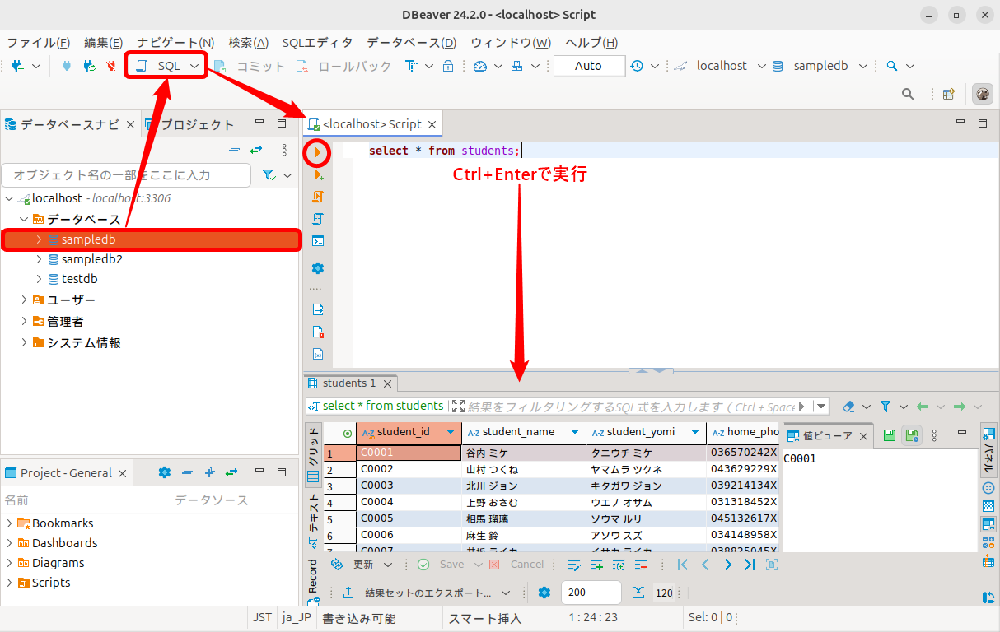</a>

#### テーブルの確認

データベース → テーブルを選択すると列の定義情報や「データ」タブで登録されているデータを確認できます。

<div class="imgtitle"></div><a href="images/img1726944050.png"></a>

#### ER図

データベースをダブルクリック→「ER図」タブでテーブル同士の関係をER図（第5章参照）で確認できます。
<div class="imgtitle">ER図（sampledbには多数のテーブルが登録されているため、ここではsampledb2を表示しています）</div>
<a href="images/img1726944086.png">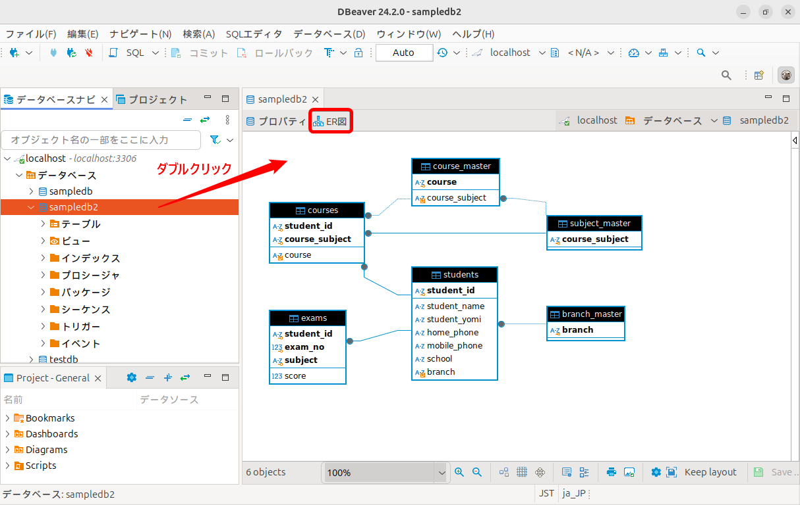</a>

#### <a name="dbeaver-import" id="dbeaver-import">サンプルデータの取り込み</a>

DBeaverでは、テーブルを右クリック→「データのインポート」でCSVデータのインポートができるようになっていますが、本書のサンプルコードはSQLコマンドで書かれているためこのメニューから取り込むことはできません。

以下を参考に、SQLエディタまたはSQLコンソールでサンプルデータを読み込んで実行してください。

<div class="imgtitle">❶データベースを選択→❷SQLエディタを開き、❸右クリック→❹SQLスクリプトをロードするでファイルを読み込む</div>
<a href="images/img1727069389.png"></a>
<div class="imgtitle">「SQLスクリプトを実行する（Alt+X）」で実行してデータを取り込む</div>
<a href="images/img1727114518.png">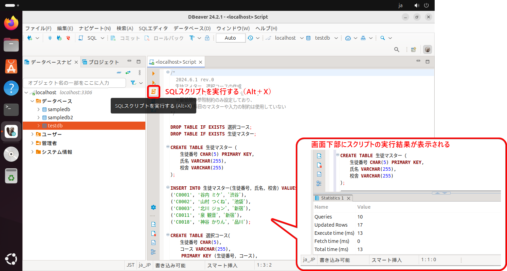</a>

## [参考]PostgreSQLのインストールと設定

本書のサンプルは原則としてMariaDBでの実行結果を掲載していますが、PostgreSQLでも同じように実行可能です。ご興味のある方は以下を参考にしてください。MariaDBと同じ環境にインストールできます。

### インストール

```
sudo apt -y install postgresql
```

### 起動の確認

インストールするとPostgreSQL（サーバー）が自動で起動します。
起動できているかどうかは下記のコマンドで確認できます（［q］キーで終了）。

```
systemctl status postgresql
```

<div class="imgtitle">（参考）実行例</div>
<a href="images/img1727131753.png">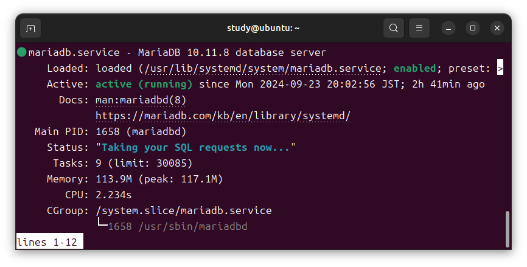</a>

<small>※`active`と表示されていない場合は、`sudo systemctl restart postgresql`を実行してエラーメッセージの有無を確認、エラーメッセージが出ていたら公式サイト等で確認。</small>

### 自動起動の設定

PostgreSQLはデフォルトで自動起動されるよう設定されています。 通常、変更する必要はありません。変更したい場合や現在の設定を確認したい場合は以下のコマンドを使用してください。

```
# 無効にする
sudo systemctl disable postgresql
# 有効にする場合：
sudo systemctl enable postgresql
# 現在の設定を確認する
systemctl is-enabled postgresql
```

### DB管理者用パスワードの設定

まず、管理者用（postgres）のパスワードを設定します。ここでは`psql`コマンドを使用しています。
`psql`コマンドはPostgreSQLサーバーに接続するためのコマンドで、MySQLの`mysql`コマンドに相当します。

`psql`だけで実行すると`postgres=#`というプロンプトが表示されてSQLを実行できる他、`psql -c "SQL文"`でSQL文を実行することができます。
ここでは、後者の方法でALTER文を実行しています。SQLキーワードは大文字で示していますが、入力は小文字でかまいません（👉2.1節「標準SQLと基本的な書式」）。

なお、PostgreSQLの管理者はpostgresというユーザーなので、ここでは`sudo -u postgres psql -c "SQL文"`のようにsudoコマンドを使用して実行しています。adminpassword部分はご自身が使用したいパスワードで置き換えて実行してください。

<small>※sudoコマンドの`-u`オプションは、どのユーザーの権限で実行するかを指定するオプションで、省略時はrootの権限で実行されます。</small>

```
sudo -u postgres psql -c "ALTER USER postgres WITH PASSWORD 'adminpassword'"
```
<div class="imgtitle">（参考）実行画面</div>
<a href="images/img1727132312.png">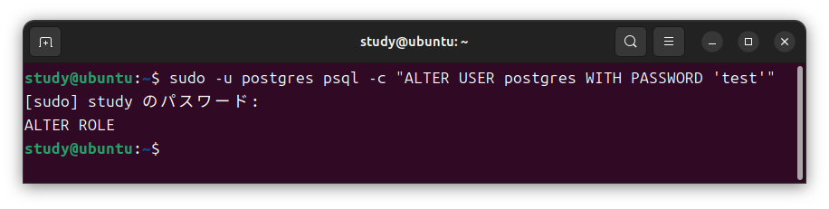</a>

### テスト用ユーザーおよびサンプル用データベースの作成

テスト用のユーザー`study`を作成し、サンプル用データベース`testdb``sampledb``sampledb2`を作成します。  

PostgreSQLの場合、ユーザー作成用およびデータベース作成用のコマンドが用意されています。
ここでは、テスト用のユーザーとして、Ubuntuをインストールする際に作成したユーザー名と同じ名前のユーザー（study）を作成しています。

```
sudo -u postgres createuser study
sudo -u postgres createdb -E utf-8 -O study testdb
sudo -u postgres createdb -E utf-8 -O study sampledb
sudo -u postgres createdb -E utf-8 -O study sampledb2
```

先ほどと同じALTER文で、テスト用のユーザー`study`がPostgreSQLに接続する際のパスワードを設定します。mypassword部分はご自身が使用したいパスワードで置き換えて実行してください。

```
sudo -u postgres psql -c "ALTER USER study WITH PASSWORD 'mypassword'"
```

### サンプルデータのDLと取り込み

サンプルデータをダウンロードします。
ファイルはカレントディレクトリに保存されます。

👉[サンプルデータについて](https://nisim-m.github.io/sqlbook2/#%E3%82%B5%E3%83%B3%E3%83%97%E3%83%AB%E3%83%87%E3%83%BC%E3%82%BF)

<strong>※MariaDB用にダウンロード済みの場合は不要</strong>
```
wget https://nisim-m.github.io/sqlbook2/sample/testdb.sql
wget https://nisim-m.github.io/sqlbook2/sample/sampledb.sql
wget https://nisim-m.github.io/sqlbook2/sample/sampledb2.sql
```

SQLが書かれたファイルは、`psql`コマンドを使い`psql -U ユーザー名 -d データベース名 -f SQLファイル名`で取り込むことができます。以下はダウンロード済みのSQLファイルがあるディレクトリで実行してください。

```
psql -U study -d testdb -f testdb.sql
psql -U study -d sampledb -f sampledb.sql
psql -U study -d sampledb2 -f sampledb2.sql
```

### サンプルデータの確認

`psql -U ユーザー名 -d データベース名`でデータベースを指定して起動し、`\dt`コマンドを実行すると、データベースに登録されているテーブルが一覧表示されます。

`\dt`はpsql独自のコマンドで、`\`は日本語キーボードの[¥]記号で入力します。画面表示が`¥`となっていても意味は同じです。

この他、`\c データベース名`でデータベースの変更、`\q`でpsqlコマンドを終了できます。

#### テスト用のSELECT文

すぐに試してみたい方は以下のSELECT文でお試し下さい。
<!-- 技術評論社の電子書籍（PDF版）の場合、書面からのコピー＆ペーストで実行できます。-->

<div class="codetitle">testdb用</div>

~~~SQL
select * from 生徒マスター where 校舎='新宿';
~~~

<div class="codetitle">sampledb, sampledb2用</div>

~~~SQL
select * from students where branch='新宿';
~~~

<div class="imgtitle">（参考）実行画面</div>
<a href="images/img1727134196.png">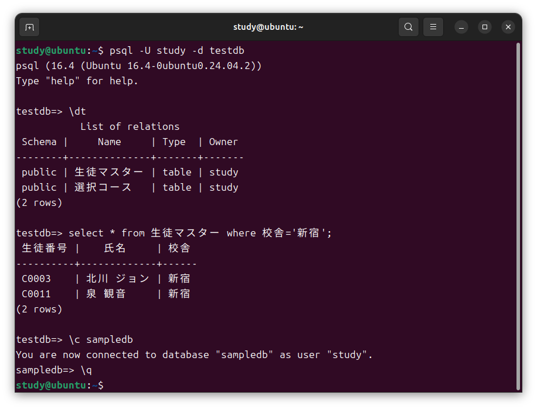</a>

実行結果が長い場合、最下行に[:]が表示されます。Enterで1行、スペースで1画面進み、上下矢印キーでスクロールできます。[Esc]キーで表示が終了します。
<small>※Linux環境で使われているlessコマンドと同じキー操作です。</small>

<div class="imgtitle">（参考）実行結果が長い場合</div>
<a href="images/img1727134240.png">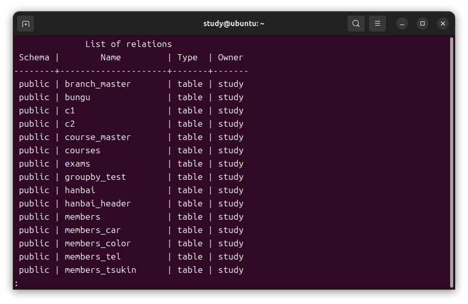</a>


### DBeaverから接続するには

❶「新しい接続」（Ctrl+Shift+N）で❷PostgreSQLを選択し、「Show all databases」にチェックマークを入れてユーザー名とパスワードを入力します。

<div class="imgtitle">❶新しい接続で❷PostgreSQLを選択</div>
<a href="images/img1727135669.png">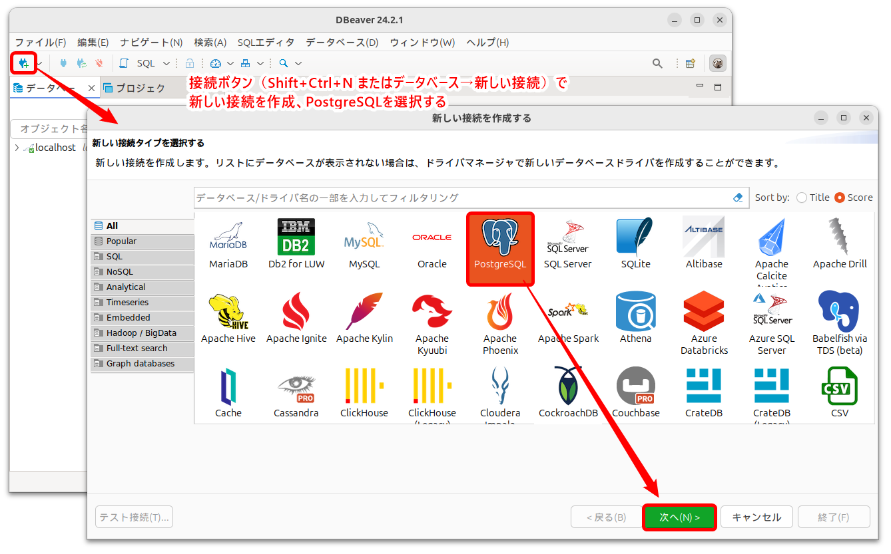</a>


<div class="imgtitle">「Show all databases」にチェックを入れてユーザー名とパスワードを入力</div>
<a href="images/img1727135761.png">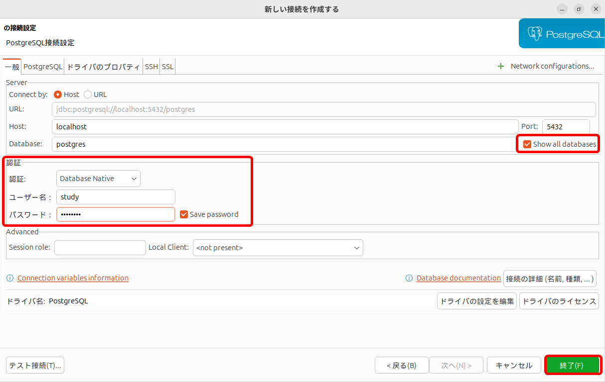</a>

「postgres」をクリックすると「ドライバの設定」が表示されるので、画面に従ってドライバファイルをダウンロードします。

<a href="images/img1727135804.png">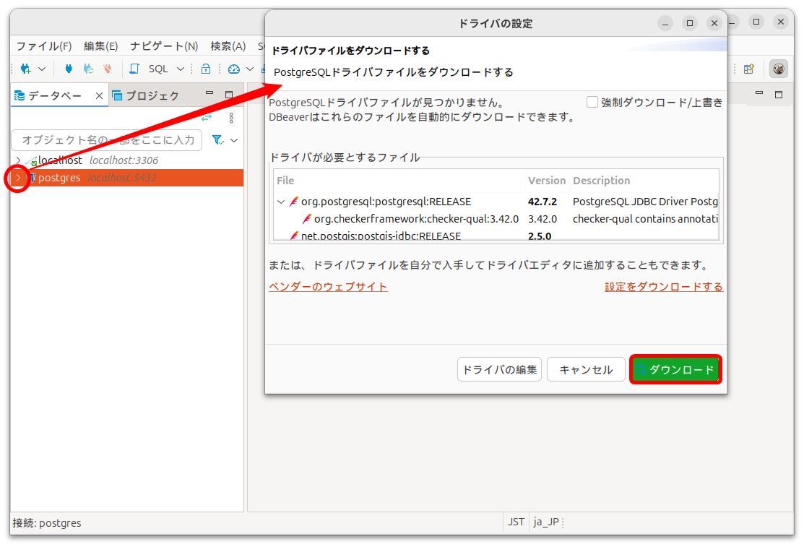</a>

ドライバのインストールが終わると元の画面に戻るので、postgresをクリックし、データベースを選択します。
データベース→スキーマ→public→テーブルでテーブル名をダブルクリックするとテーブルの情報を確認できます。

<a href="images/img1727136763.png">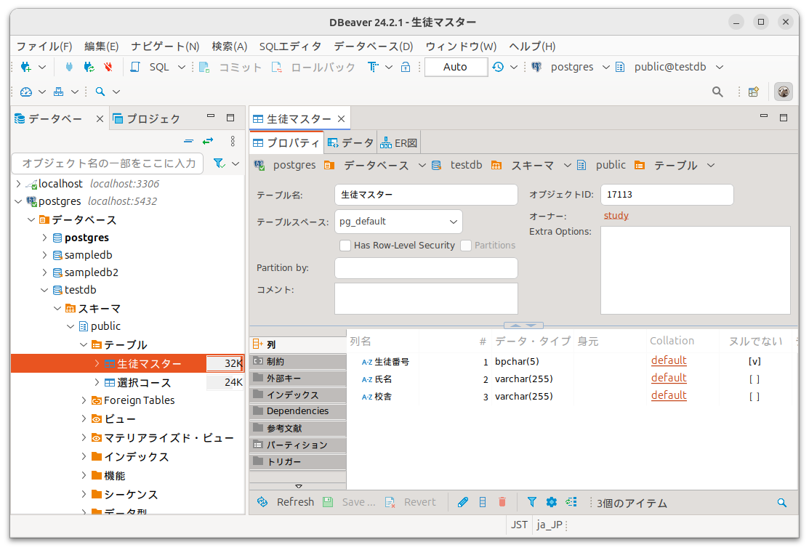</a>

データベースを選択して「SQL」でSQLエディタを開きます。SQL文は▶ボタンまたはCtrl+Enterで実行され、実行結果が画面に表示されます。

<a href="images/img1727137373.png">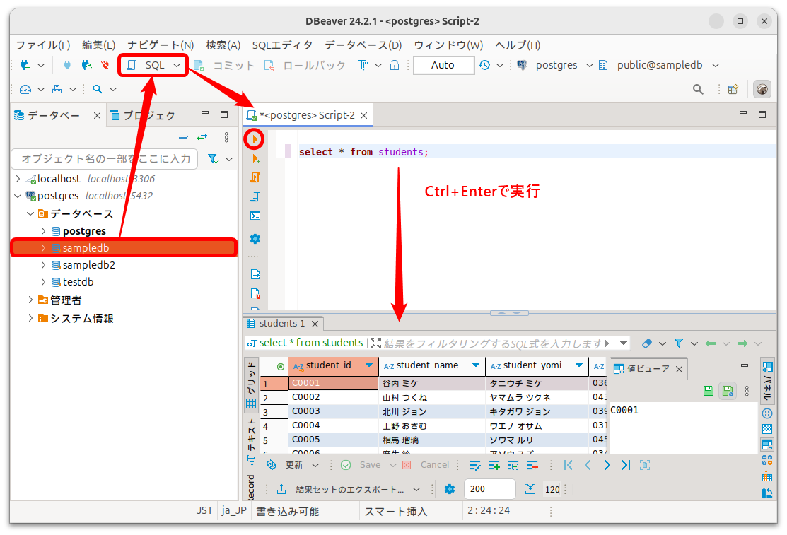</a>

#### サンプルデータベースが表示されない場合

データベースが「postgres」（デフォルトデータベース）のみで、[サンプル用データベースの作成](#テスト用ユーザーおよびサンプル用データベースの作成)の手順で作成したtestdbなどのサンプルデータベースが表示されない場合は、接続を編集して「Show all databases」にチェックマークを入れてください。

<div class="imgtitle">右クリック→「接続 編集」で「Show all databases」に✔</div><a href="images/img1727136803.png">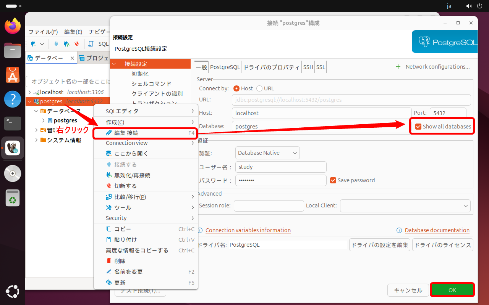</a>

----
[標準SQL＋データベース入門 サポートページ](https://nisim-m.github.io/sqlbook2/)
