[サポートページ](https://nisim-m.github.io/sqlbook2/) ～学習用環境（Windows + VMware + Ubuntu）～
# VMware + Ubuntu

<!-- TOC -->
1. [ファイルのダウンロード](#ファイルのダウンロード)
   1. [Broadcomのアカウントを作成してログイン](#broadcomのアカウントを作成してログイン)
   2. [VMwareのダウンロード](#vmwareのダウンロード)
   3. [UbunutuのISOイメージ](#ubunutuのisoイメージ)
2. [VMwareのインストール](#vmwareのインストール)
3. [仮想マシンの作成](#仮想マシンの作成)
   1. [CD/DVDイメージの設定](#cddvdイメージの設定)
4. [ゲストOS（Ubuntu）のインストール](#ゲストosubuntuのインストール)
   1. [再起動後の設定](#再起動後の設定)
      1. [Ubuntuデスクトップ](#ubuntuデスクトップ)
      2. [端末アプリ](#端末アプリ)
   2. [VMware Tools](#vmware-tools)
5. [スナップショットの活用](#スナップショットの活用)
6. [Ubuntuの設定](#ubuntuの設定)
      1. [解像度の変更](#解像度の変更)
   1. [スリープまでの時間](#スリープまでの時間)
   2. [フォルダ名をアルファベットにする](#フォルダ名をアルファベットにする)
7. [ネットワークが切断されてしまった場合](#ネットワークが切断されてしまった場合)
<!-- /TOC -->

## ファイルのダウンロード

VMwareとUbuntuのISOイメージ
VMwareのダウンロードにはBroadcomのアカウント（無料）が必要

### Broadcomのアカウントを作成してログイン

https://support.broadcom.com/
Register

### VMwareのダウンロード

VMware Workstation Pro

ProductDownloads - Support Portal - Broadcom support portal
https://support.broadcom.com/group/ecx/productdownloads?subfamily=VMware+Workstation+Pro

※mac用はFusion
https://support.broadcom.com/group/ecx/productdownloads?subfamily=VMware+Fusion

### UbunutuのISOイメージ

インストール用のイメージファイルは [https://jp.ubuntu.com/download](https://jp.ubuntu.com/download) からダウンロードできます。本書では、Ubuntu Desktop 24.04 LTS（`ubuntu-24.04-desktop-amd64.iso`）を使用しています。

## VMwareのインストール

VMwareのインストール（Windows環境の状態やVMwareのバージョンによって異なる画面が表示される可能性があります）

※インストールに先立ち以下のメッセージが表示されることがある

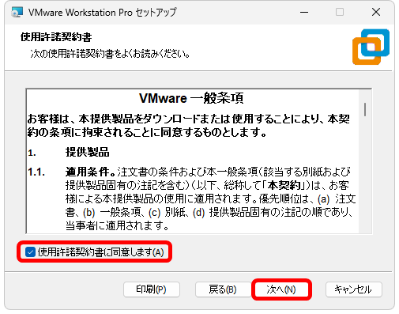

いずれも任意
[仮想マシンの拡張仮想キーボード機能の使用](https://docs.vmware.com/jp/VMware-Workstation-Player-for-Windows/17.0/com.vmware.player.win.using.doc/GUID-D7E859A1-AD77-41A0-9B20-8B15744056E1.html)

いずれも任意

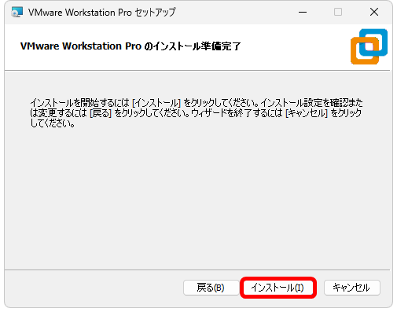

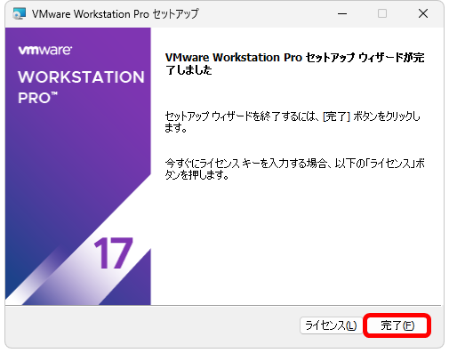

再起動を促された場合は再起動

VMwareを実行

「個人利用目的」を選択

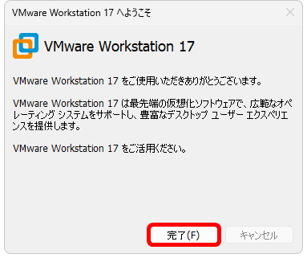

## 仮想マシンの作成

VMwareを実行し、新規仮想マシンの作成（Ctrl+N）で仮想マシンを作成、ゲストOS（Ubuntu）をインストールします。

「標準」を選択して「次へ」

「後でOSをインストール」を選択して「次へ」

ゲストOSを「Linux」、バージョンを「Ubuntu」にして「次へ」

必要に応じ仮想マシン名とインストール先を変更して「次へ」
（ここでは自動で設定されるUbuntuのまま、インストール先はドキュメントフォルダのままにしている）

必要に応じディスク容量を変更して「次へ」（今回の目的の場合20GBのままで問題ない、実際のディスクスペースは仮想マシンのインストールで使用している分のみを消費する、あとで増やすことも可能）
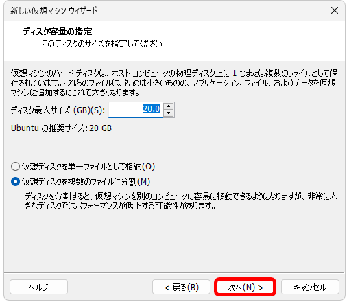

完了で仮想マシンが作成される（設定を変更したい場合は「ハードウェアのカスタマイズ」、今回の目的の場合は不要、後から変更することも可能）

（仮想マシンが作成できた）

ゲストOSに割り当てるメモリーのサイズは、たくさん割り当てることでゲストOSが快適に動作するようになりますが、その分、ホストOSの動作が犠牲になります。 本書のSQLを試すだけであれば、1024～2048MB程度で問題ありません。

### CD/DVDイメージの設定

仮想マシンの「CD/DVD」をクリック（仮想マシンを選択して「編集」→「環境設定」→「」）してダウンロードしてあるISOイメージを選択します。
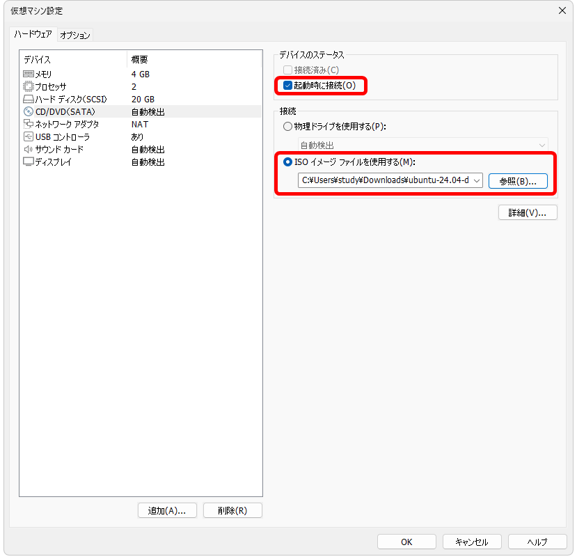

## ゲストOS（Ubuntu）のインストール

起動ボタン（▶この仮想マシンをパワーオンする）をクリックすると、仮想マシンの作成時に選択たISOイメージからUbuntuが起動するので、画面に従ってインストールを行います。

（しばらく待つ）

<small>
※インストール中に「System program problem detected」というメッセージが表示されることがある。インストールを中断・リトライした場合に多い。ひとまずCancelでインストールを続行し、その後も頻発するようだったら仮想マシンを作り直してインストールする等を検討。</small>

<small>
※「続ける」というボタンは画面の右下に表示されています。 ※ボタンが画面上に表示されない場合はAlt+F7でスクロール（<a href="https://nisim-m.github.io/linuxcmdbook/howto/altf7.html">画面例</a>）*</small>

<small>
ゲストOSの画面をクリックすると、キー操作やマウス入力をゲストOSが受け取る状態（キャプチャーされた状態）となる。
右Ctrl＋Altで解放されてホストOS側の操作が可能になる。
マウスをゲストOSの外に動かすと自動的にホストOS側の操作に戻るが、
一部のキー操作（PrtScreen等）がゲストOS側にキャプチャされたままになることがある。この場合も右Ctrl+AltでホストOS側での操作が可能になる。
</small>

スリープ状態のゲストOSを選択するとキャプチャされたままになることがある、この場合も右Ctrl+Alt

キャプチャの設定はVMwareの設定（編集→環境設定、Ctrl+P）の「入力」で変更（Ctrl+Altのキーバインドは変更できない）
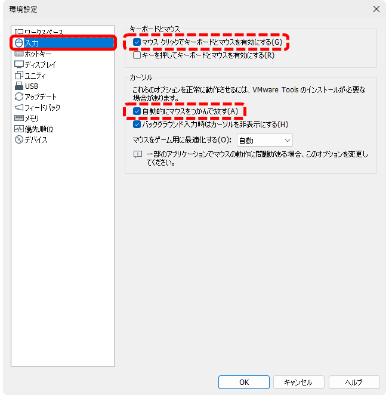

言語の選択（下の方にスクロールすると「日本語」がある）

日本語を選択するとインストール画面が日本語になり、キーボードの選択等も自動で日本語用になる（適宜変更可能）

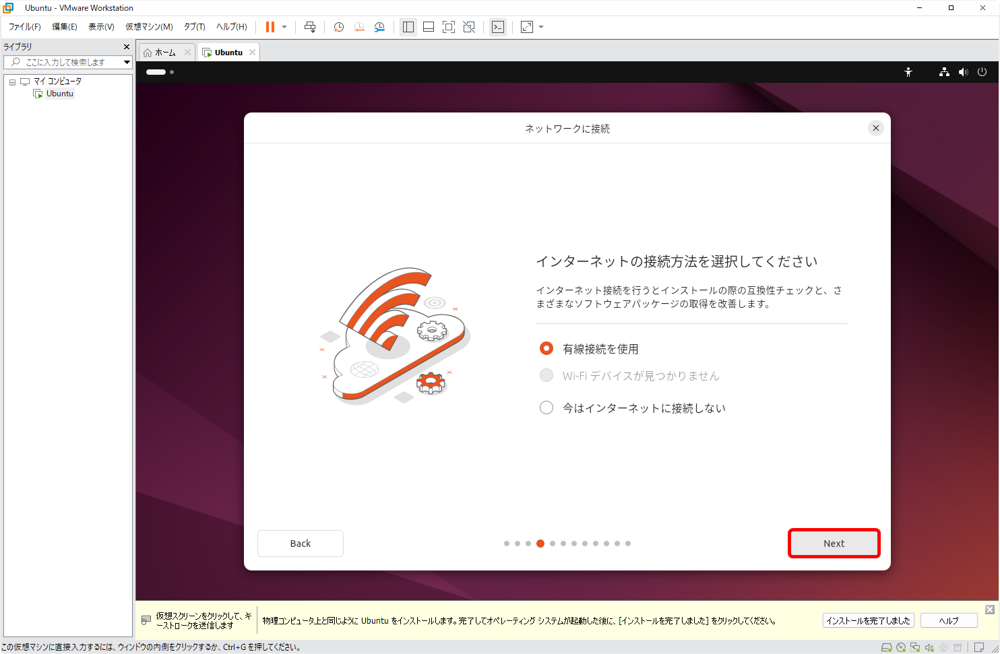

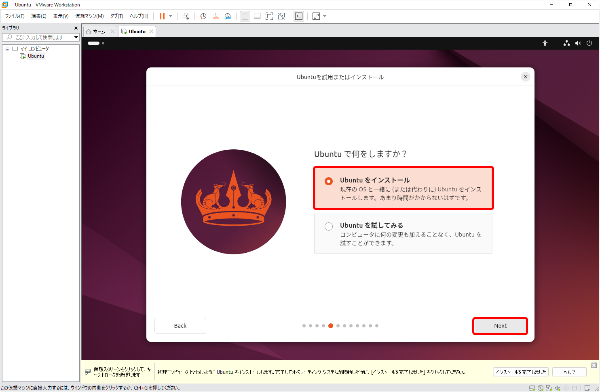

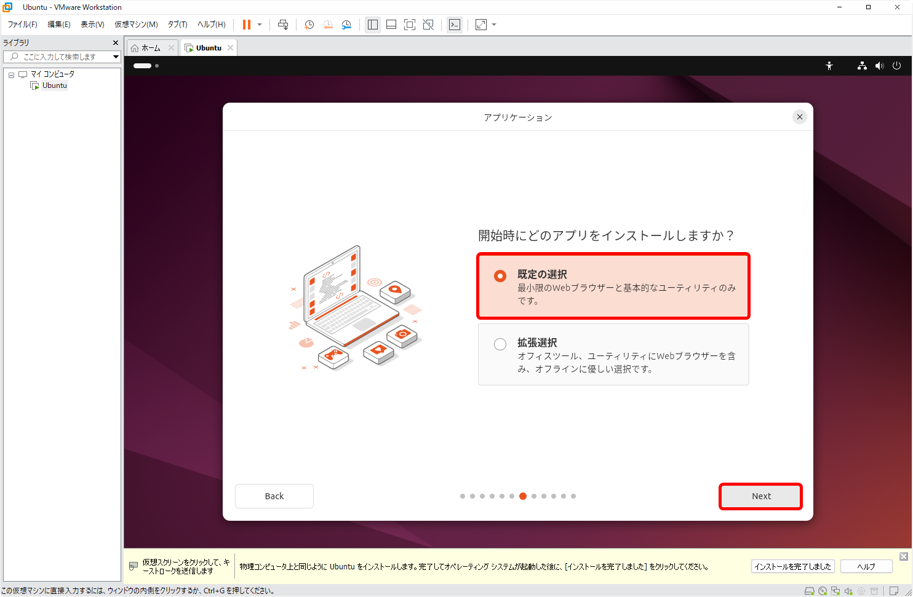

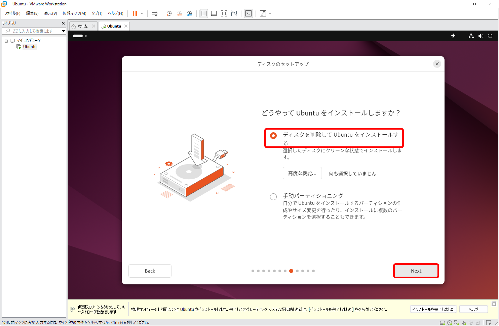

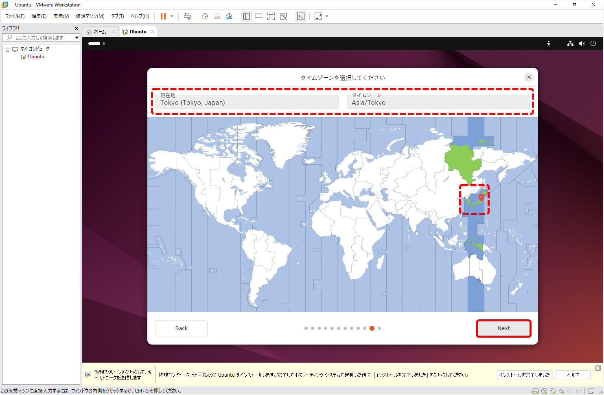

しばらく待つ

再起動

このメッセージが出た場合Enter：おそらく設定を変更する必要は無いが再度ISOイメージからの起動（インストール画面）が開くようならば「切断」

### 再起動後の設定

再起動するとアカウントが表示されるのでクリックして画面に従ってパスワードを入力しログイン

GUI画面が表示されるのでインストールを完了させます。

選択は任意
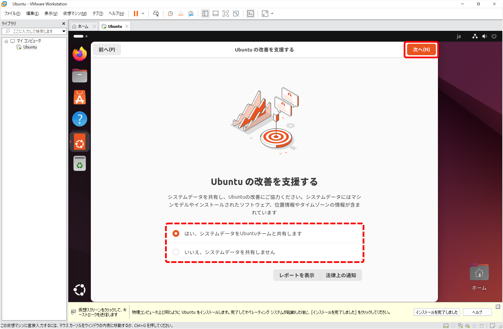

#### Ubuntuデスクトップ

Ubuntuデスクトップは以下の様な画面構成になっています。

#### 端末アプリ

コマンドは「端末」アプリケーションで入力して実行します。アプリはdockに登録できます。

端末

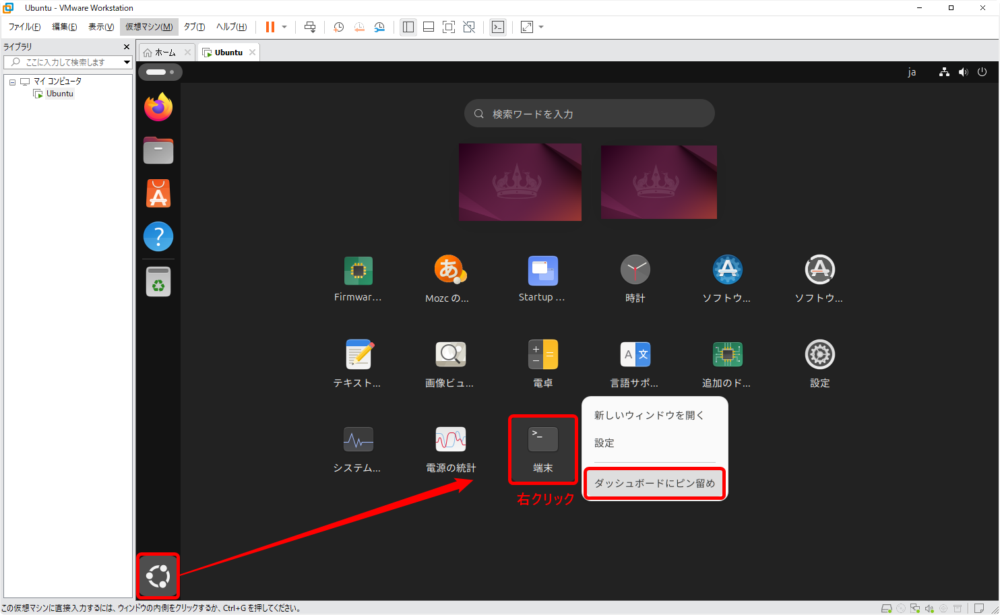

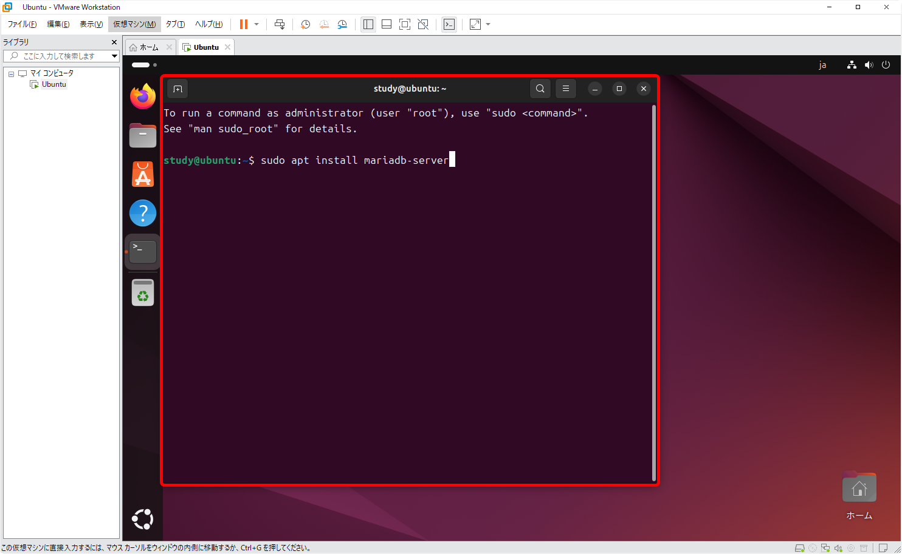

### VMware Tools

「VMware Tools」をインストールすると、ホストOSと端末の間でのコピー&ペーストが可能になります。

VMware Toolsは自動インストール
インストール中インターネットに接続できなかった等でインストールできていない場合がある

sudo apt install open-vm-tools-desktop

※インストール済みの場合はその旨表示される

## スナップショットの活用

VirtualBoxでは、任意のタイミングでゲストOSのスナップショットを作成しておくことができます。本書の学習ではあまり必要ありませんが、興味がある方は以下を参考にしてください。

<a href="https://nisim-m.github.io/linuxcmdbook/howto/install-ubuntu.html#%E3%82%B9%E3%83%8A%E3%83%83%E3%83%97%E3%82%B7%E3%83%A7%E3%83%83%E3%83%88%E3%81%AE%E6%B4%BB%E7%94%A8">スナップショットの活用（Linux1＋コマンド入門サポートページ内）</a>

## Ubuntuの設定

システム全体の設定はデスクトップ右上をクリックして設定メニュー

デスクトップの設定は「Ubuntuソフトウェア」の「Extension Manager」でもカスタマイズできます（例：Hide ClockエクステンションでTopパネルのカレンダーを非表示にする、等）。

#### 解像度の変更

解像度は再起動後「設定」から変更できます。

「設定」をクリック
スクロールして「ディスプレイ」を探し、クリックして「解像度」を変更
「適用」で保存
<small>※解像度はVMwareの「表示」メニューや、ウィンドウサイズの変更でも調整可能</small>

### スリープまでの時間

学習の性質上、画面を見ているが操作はしない、という時間が長くなりがちです。デフォルトでは操作していないと5分で画面がオフになりますが、この時間は「電源管理」の「省電力オプション」で設定できます。

スリープ状態のゲストOSを選択するとキャプチャされたままになることがある、この場合も右Ctrl+Alt

### フォルダ名をアルファベットにする

ユーザーフォルダ（ユーザーのホームディレクトリ）にある「書類」や「ピクチャ」などのフォルダは、WindowsやmacOSの場合、実体はDocumentsやPicturesなどのアルファベットで付けられた名前になっていますが、日本語用にインストールしたUbuntuデスクトップの場合は実体も「書類」など日本語の名前になっています。本書ではコマンドラインでこれらのフォルダを扱うことはありませんが、今後、コマンドラインでほかの操作にも慣れていこうという場合、アルファベットの名前の方が扱いやすいでしょう。変更する場合は以下のコマンドを実行し画面の指示に従ってください。

<code>
LANG=C xdg-user-dirs-gtk-update
</code>

<small>※`LANG=C`スペース`xdg-u`<kbd>Tab</kbd>`s-g`<kbd>Tab</kbd><kbd>Enter</kbd>で実行できます。パスワード入力を求められたらUbuntuインストール時のパスワードを入力してください。</small>

Update standard folders～というメッセージが表示されるので「Update Names」をクリック

ディレクトリ（フォルダ）名が変更される

再起動後あらためてフォルダ名の変更を確認するメッセージが表示されたら「次回から表示しない」にチェックマークを入れて「古い名前のままにする」をクリックしてください。

## ネットワークが切断されてしまった場合

VirtualBoxのUbuntuを起動したままホストOSがスリープ状態になると、復帰後のUbuntuでネットワークが使えなくなることがあります。

VirtualBoxの「デバイス」メニューで「ネットワーク」の「ネットワークアダプターを接続」をクリックしていったん切断し、再度、「ネットワークアダプターを接続」をクリックして接続し直してください。

Ubuntuの再起動でも元の状態に戻ります。よくわからない時はいったん再起動してみてください。

----

[TCP/IP＆ネットワークコマンド入門 サポートページ](https://nisim-m.github.io/tcpipcmdbook/)
