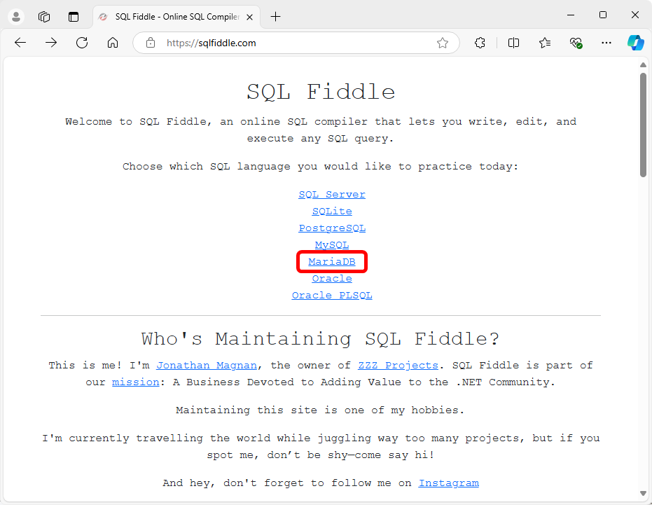
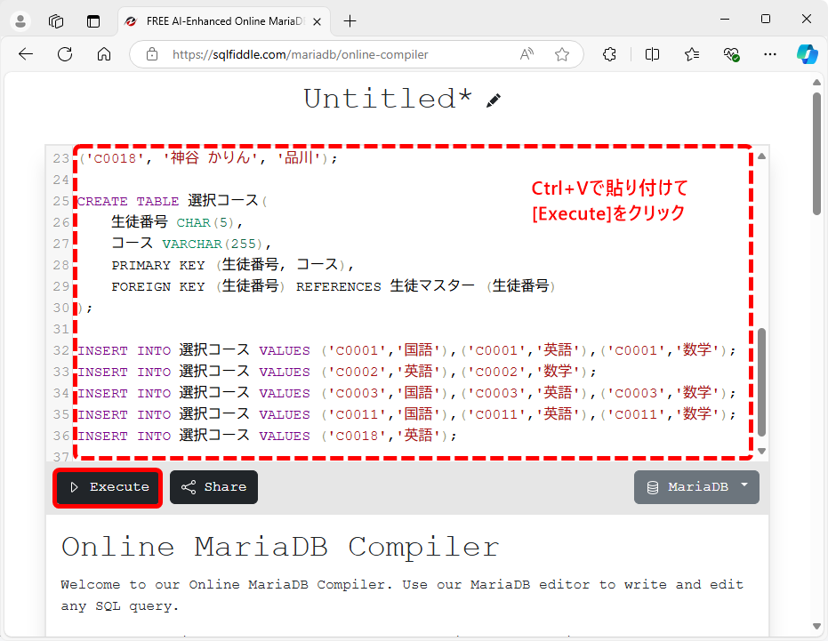
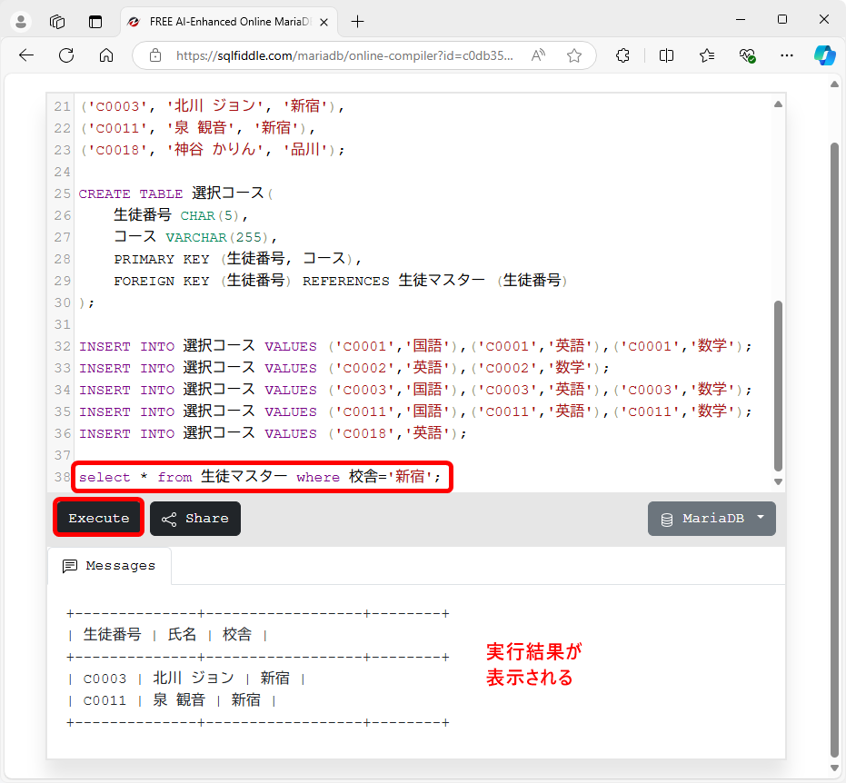

[標準SQL＋データベース入門 サポートページ](httpsnisim-m.github.iosqlbook2) 
# 学習用環境（SQL&nbsp;Fiddle）

<!-- TOC -->
1. [データベースエンジンの選択](#データベースエンジンの選択)
2. [サンプルデータの登録](#サンプルデータの登録)
3. [SQL文の実行](#sql文の実行)
   1. [テスト用のSELECT文](#テスト用のselect文)
<!-- /TOC -->

SQL&nbsp;Fiddle（[https://sqlfiddle.com/](https://sqlfiddle.com/)）というオンラインサービスを利用することで、手軽にSQLを学習できます。

利用に先立ち、本書のサンプルデータ（[👉サンプルデータ](https://nisim-m.github.io/sqlbook2/#%E6%9C%AC%E6%9B%B8%E3%81%A7%E4%BD%BF%E7%94%A8%E3%81%99%E3%82%8B%E3%82%B5%E3%83%B3%E3%83%97%E3%83%AB%E3%83%87%E3%83%BC%E3%82%BF%E3%83%99%E3%83%BC%E3%82%B9)）をダウンロードし、テキストエディタ（メモ帳など）で表示できるようにしておいてください。

## データベースエンジンの選択

[https://sqlfiddle.com/](https://sqlfiddle.com/)にアクセスし、データベースエンジンを選択します。本書のサンプルはMySQL/MariaDB/PostgreSQL/SQL&nbsp;Serverに対応しています。
<small>※SQL&nbsp;Serverの場合は専用のサンプルデータ（[👉SQL&nbsp;Server用](https://nisim-m.github.io/sqlbook2/#sqlserver%E7%94%A8)）を使用して下さい。</small>

データベースエンジンを選択（ここではMariaDBを使用）

## サンプルデータの登録

SQL&nbsp;Fiddleが用意しているサンプルデータを作成するためのSQL文が自動で入力された状態になっているので❶削除し、❷本書のサンプルデータを貼り付けて、❸Executeで実行します。

❶SQL&nbsp;Fiddleのサンプルデータを作成するSQL文を削除

❷テキストエディタでサンプルデータを開き全体を選択してコピー

❸SQL&nbsp;Fiddleの入力エリアに貼り付けて「Execute」をクリック

<small>※サンプルデータ作成用のSQL（testdb.sql、sampledb.sql、samplesb2.sql）はテーブルの作成とデータの登録のみなので実行結果は特に表示されません。</small>

## SQL文の実行

SQL&nbsp;Fiddleの入力エリアにSQL文を入力して「Execute」をクリックすると、実行結果が表示されます。

### テスト用のSELECT文

すぐに試してみたい方は以下のSELECT文でお試し下さい。
<!-- 技術評論社の電子書籍（PDF版）の場合、書面からのコピー＆ペーストで実行できます。-->

testdb用

~~~SQL
select * from 生徒マスター where 校舎='新宿';
~~~

sampledb, sampledb2用

~~~SQL
select * from students where branch='新宿';
~~~

----
[標準SQL＋データベース入門 サポートページ](https://nisim-m.github.io/sqlbook2/)
